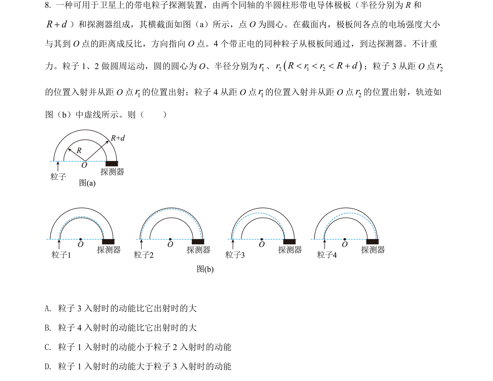
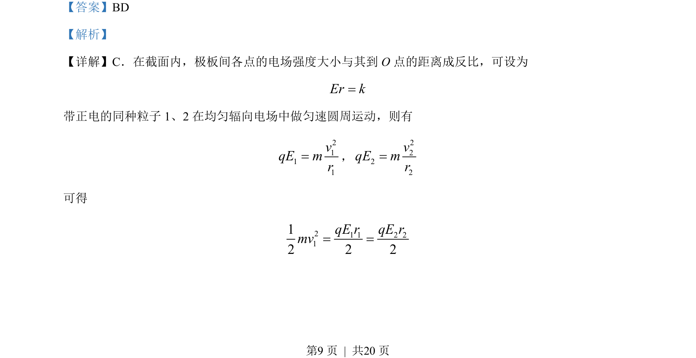
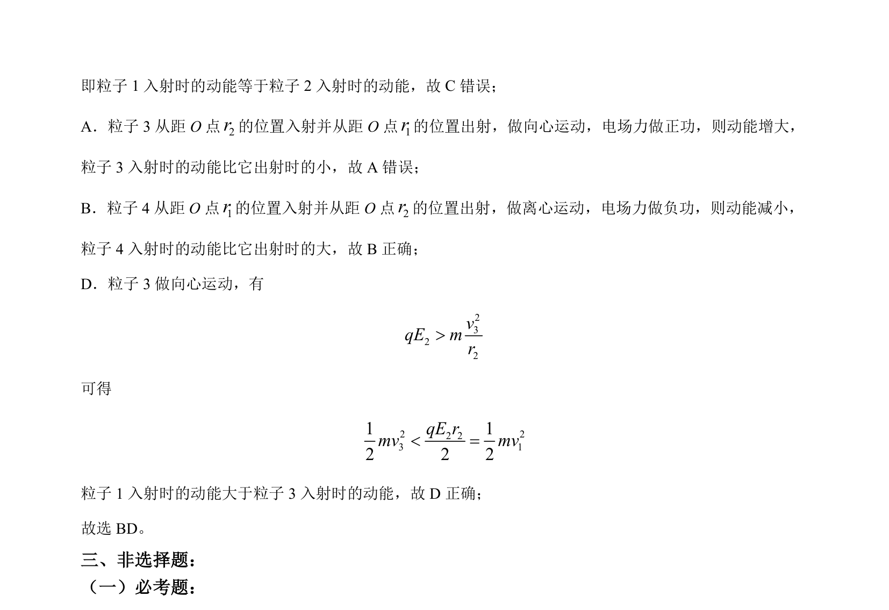

## 题面

## 摘要

带电粒子在辐向电场中的匀速圆周运动与向心、离心运动分析，比较动能大小。

## 关联考点

- [[277-电场强度|电场强度]]
- [[253-匀速圆周运动|匀速圆周运动]]
- [[251-动能定理|动能定理]]
- [[461-向心运动|向心运动]]

## 答案与解析

> 📄 原 PDF 第 9 页：`素材/真题/吉林/2008-2024·（吉林）物理高考真题/2022年高考物理试卷（全国乙卷）（解析卷）.pdf`

<!-- 题干文本-start -->
## 题干文本
8. 一种可用于卫星上的带电粒子探测装置，由两个同轴的半圆柱形带电导体极板（半径分别为 R和
R d+）和探测器组成，其横截面如图（a）所示，点 O 为圆心。在截面内，极板间各点的电场强度大小
与其到 O 点的距离成反比，方向指向 O 点。4 个带正电的同种粒子从极板间通过，到达探测器。不计重
力。粒子 1、2 做圆周运动，圆的圆心为 O、半径分别为1r、()2 1 2r R r r R d< < < +；粒子 3 从距 O 点2r
的位置入射并从距 O 点1r的位置出射；粒子 4 从距 O 点1r的位置入射并从距 O 点2r的位置出射，轨迹如
图（b）中虚线所示。则（　　）
A. 粒子 3 入射时的动能比它出射时的大
B. 粒子 4 入射时的动能比它出射时的大
C. 粒子 1 入射时的动能小于粒子 2 入射时的动能
D. 粒子 1 入射时的动能大于粒子 3 入射时的动能
<!-- 题干文本-end -->

<!-- 解析文本-start -->
## 解析文本
【答案】BD
【解析】
【详解】C．在截面内，极板间各点的电场强度大小与其到 O 点的距离成反比，可设为
Er k=
带正电的同种粒子 1、2 在均匀辐向电场中做匀速圆周运动，则有
2111vqE mr=，
2222vqE mr=
可得
21 1 2 2112 2 2qE r qE rmv= =
<!-- 解析文本-end -->
