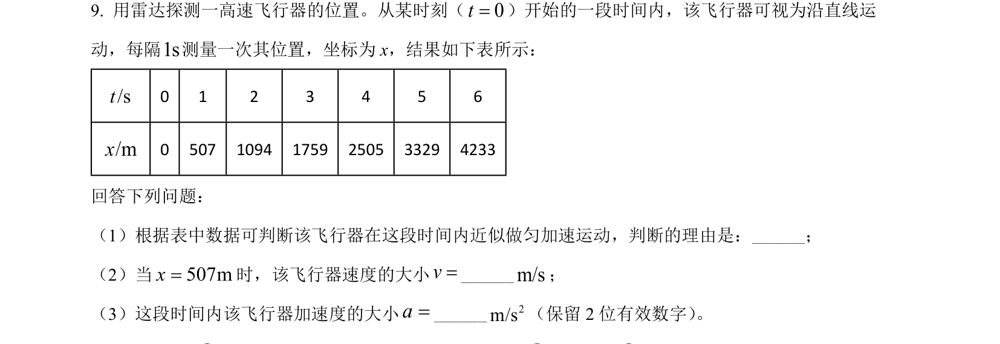
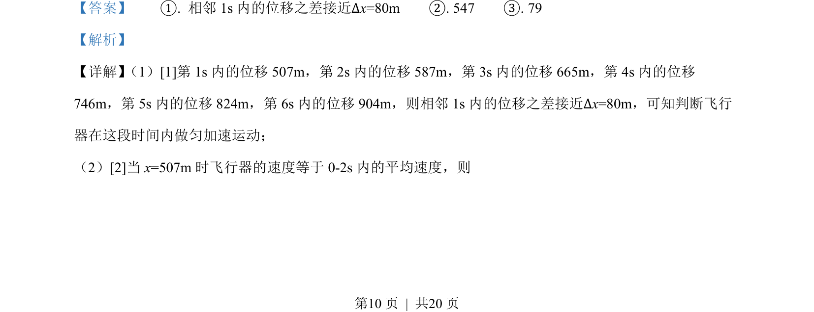

## 题面

## 摘要

根据位移差判断匀加速运动，并利用平均速度求瞬时速度及逐差法计算加速度。

## 关联考点

- [[542-匀变速直线运动判别|匀变速直线运动判别]]
- [[603-平均速度法求瞬时速度|平均速度法求瞬时速度]]
- [[742-逐差法求加速度|逐差法求加速度]]

## 答案与解析

> 📄 原 PDF 第 10 页：`素材/真题/吉林/2008-2024·（吉林）物理高考真题/2022年高考物理试卷（全国乙卷）（解析卷）.pdf`
