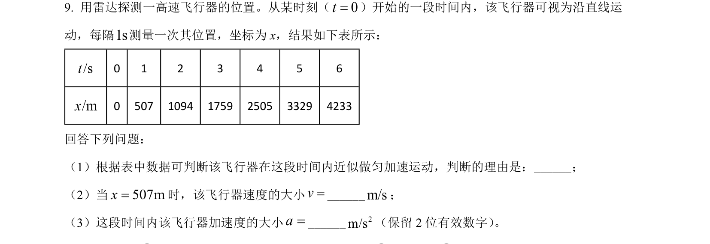
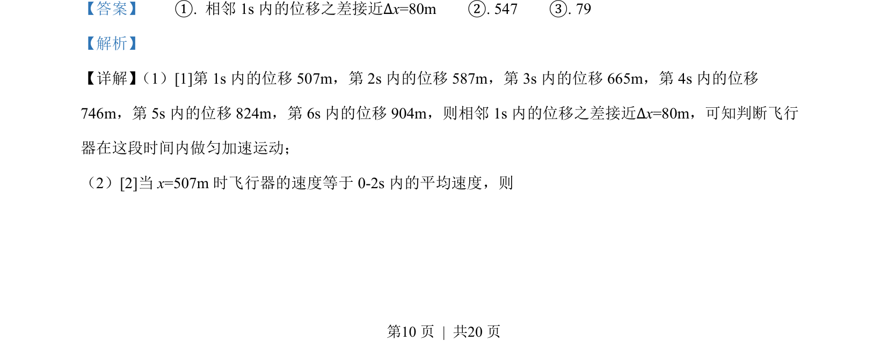

## 题面

## 摘要

根据位移差判断匀加速运动，并利用平均速度求瞬时速度及逐差法计算加速度。

## 关联考点

- [[542-匀变速直线运动判别|匀变速直线运动判别]]
- [[603-平均速度法求瞬时速度|平均速度法求瞬时速度]]
- [[741-逐差法求加速度|逐差法求加速度]]

## 答案与解析

> 📄 原 PDF 第 10 页：`素材/真题/吉林/2008-2024·（吉林）物理高考真题/2022年高考物理试卷（全国乙卷）（解析卷）.pdf`

<!-- 题干文本-start -->
## 题干文本
9. 用雷达探测一高速飞行器的位置。从某时刻（0=t）开始的一段时间内，该飞行器可视为沿直线运
动，每隔1s测量一次其位置，坐标为 x，结果如下表所示：
/st0 1 2 3 4 5 6
/mx0 507 1094 1759 2505 3329 4233
回答下列问题：
（1）根据表中数据可判断该飞行器在这段时间内近似做匀加速运动，判断的理由是：______；
（2）当507mx=时，该飞行器速度的大小=v______m/s；
（3）这段时间内该飞行器加速度的大小=a______2m/s（保留 2 位有效数字） 。
<!-- 题干文本-end -->

<!-- 解析文本-start -->
## 解析文本
【答案】    ①. 相邻 1s 内的位移之差接近∆x=80m    ②. 547    ③. 79
【解析】
【详解】 （1）[1]第 1s 内的位移 507m，第 2s 内的位移 587m，第 3s 内的位移 665m，第 4s 内的位移
746m，第 5s 内的位移 824m，第 6s 内的位移 904m，则相邻 1s 内的位移之差接近∆x=80m，可知判断飞行
器在这段时间内做匀加速运动；
（2）[2]当 x=507m时飞行器的速度等于 0-2s 内的平均速度，则
<!-- 解析文本-end -->
