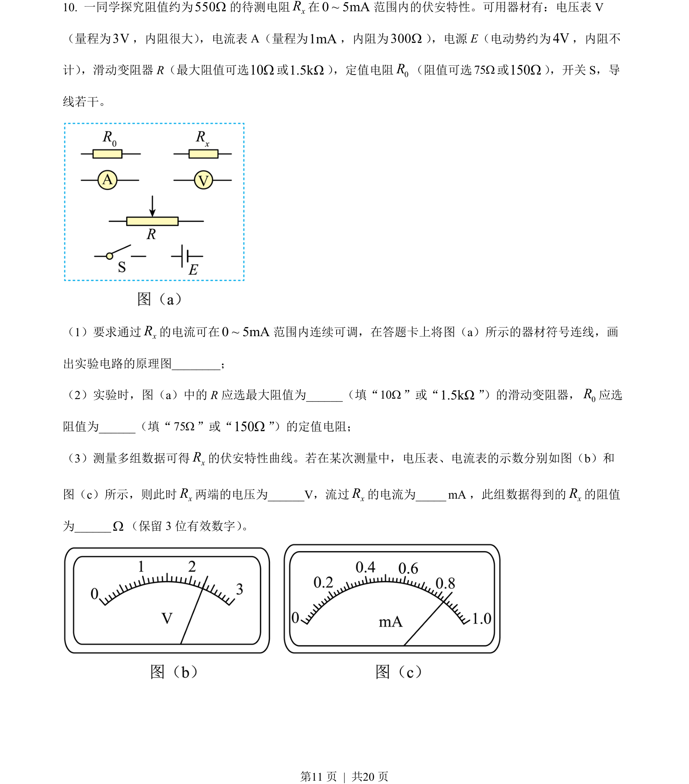
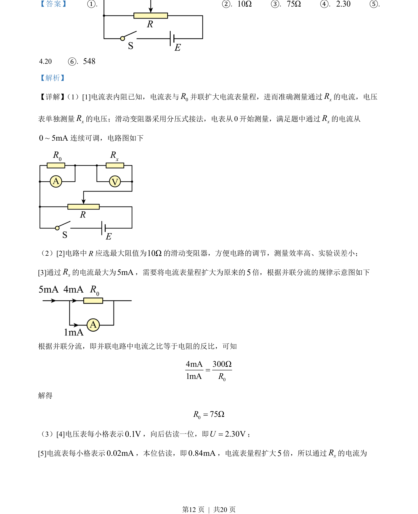
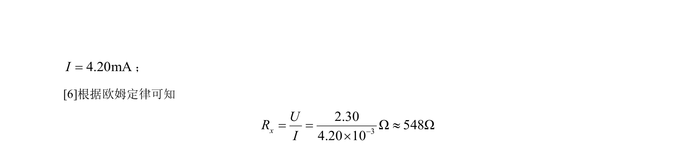

## 题面

## 摘要

伏安法测电阻实验，涉及电流表改装扩程与电路设计及数据处理。

## 关联考点

- [[697-电路设计|电路设计]]
- [[690-电表改装|电表改装]]
- [[141-欧姆定律-初中|欧姆定律]]
- [[901-数据处理|数据处理]]

## 答案与解析

> 📄 原 PDF 第 11 页：`素材/真题/吉林/2008-2024·（吉林）物理高考真题/2022年高考物理试卷（全国乙卷）（解析卷）.pdf`
