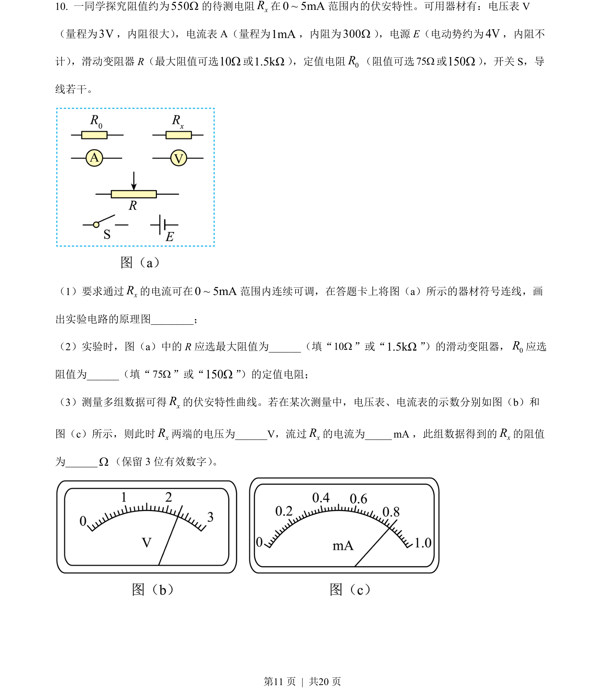
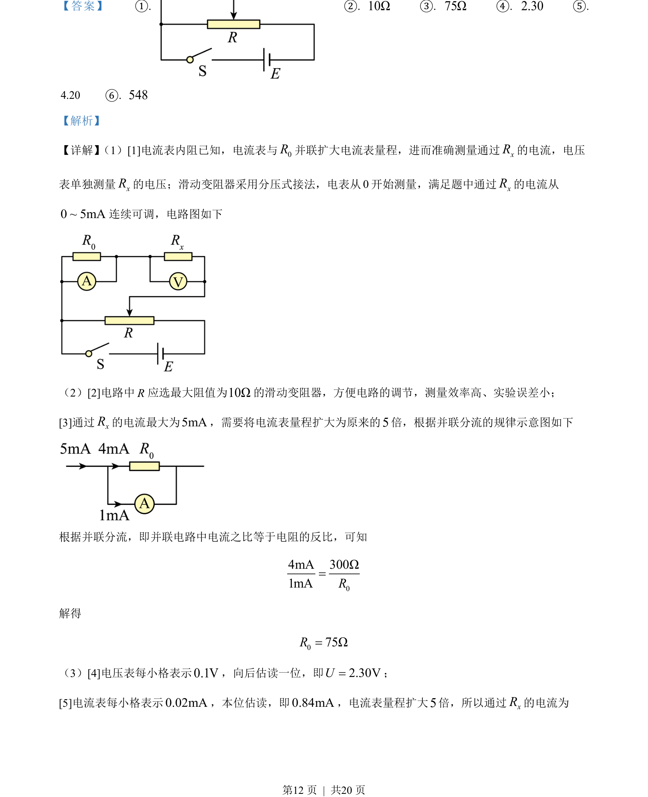
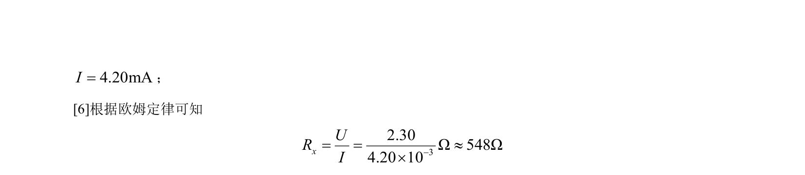

## 题面

## 摘要

伏安法测电阻实验，涉及电流表改装扩程与电路设计及数据处理。

## 关联考点

- [[697-电路设计|电路设计]]
- [[690-电表改装|电表改装]]
- [[141-欧姆定律-初中|欧姆定律]]
- [[901-数据处理|数据处理]]

## 答案与解析

> 📄 原 PDF 第 11 页：`素材/真题/吉林/2008-2024·（吉林）物理高考真题/2022年高考物理试卷（全国乙卷）（解析卷）.pdf`

<!-- 题干文本-start -->
## 题干文本
10. 一同学探究阻值约为550W的待测电阻xR在0 ~ 5mA范围内的伏安特性。可用器材有：电压表 V
（量程为3V，内阻很大） ，电流表A（量程为1mA，内阻为300W） ，电源E（电动势约为4V，内阻不
计） ，滑动变阻器R（最大阻值可选10W或1.5kΩ） ，定值电阻0R（阻值可选75W或150W） ，开关S，导
线若干。
（1）要求通过xR的电流可在0 ~ 5mA范围内连续可调，在答题卡上将图（a）所示的器材符号连线，画
出实验电路的原理图________；
（2）实验时，图（a）中的 R应选最大阻值为______（填“10W”或“1.5kΩ”）的滑动变阻器，0R应选
阻值为______（填“75W”或“150W”）的定值电阻；
（3）测量多组数据可得xR的伏安特性曲线。若在某次测量中，电压表、电流表的示数分别如图（b）和
图（c）所示，则此时xR两端的电压为______V，流过xR的电流为_____mA，此组数据得到的xR的阻值
为______W（保留 3 位有效数字） 。
<!-- 题干文本-end -->

<!-- 解析文本-start -->
## 解析文本

<!-- 解析文本-end -->
