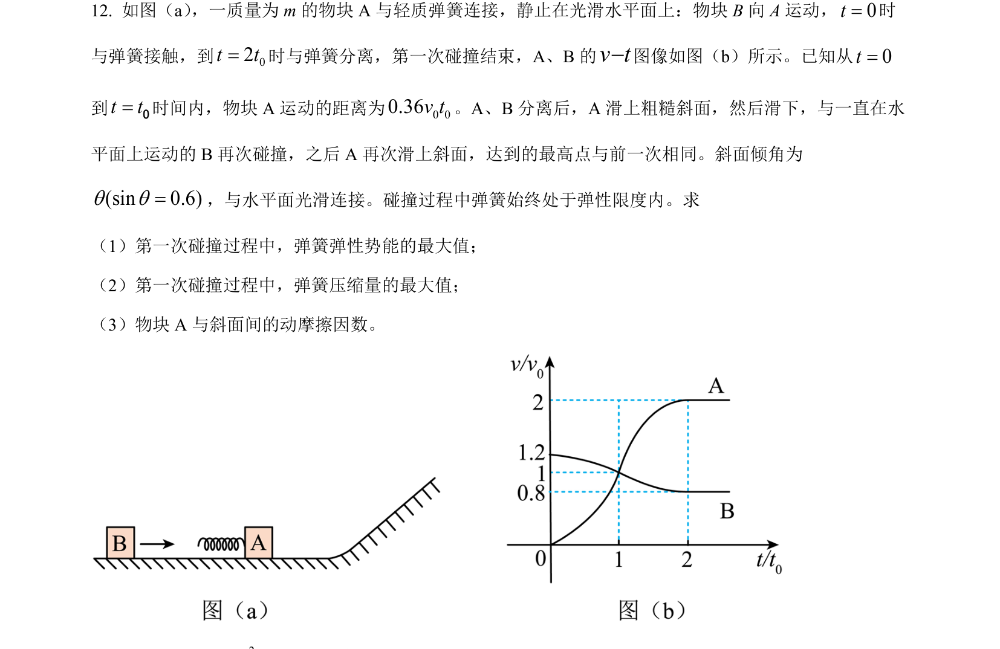
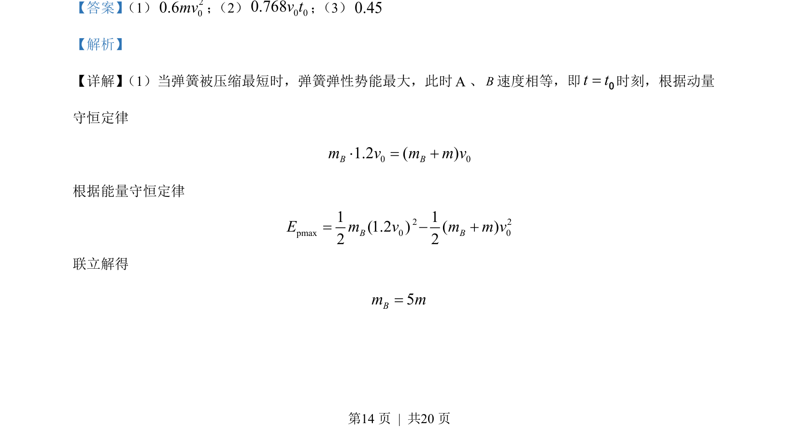

## 题面

## 摘要

本题通过弹簧模型综合考查动量守恒与能量守恒的应用，涉及方程联立求解和积分思想求位移。

## 关联考点

- [[动量守恒]]
- [[197-能量守恒定律|能量守恒]]
- [[061-方程|方程求解]]
- [[积分思想]]

## 答案与解析

> 📄 原 PDF 第 14 页：`素材/真题/吉林/2008-2024·（吉林）物理高考真题/2022年高考物理试卷（全国乙卷）（解析卷）.pdf`
