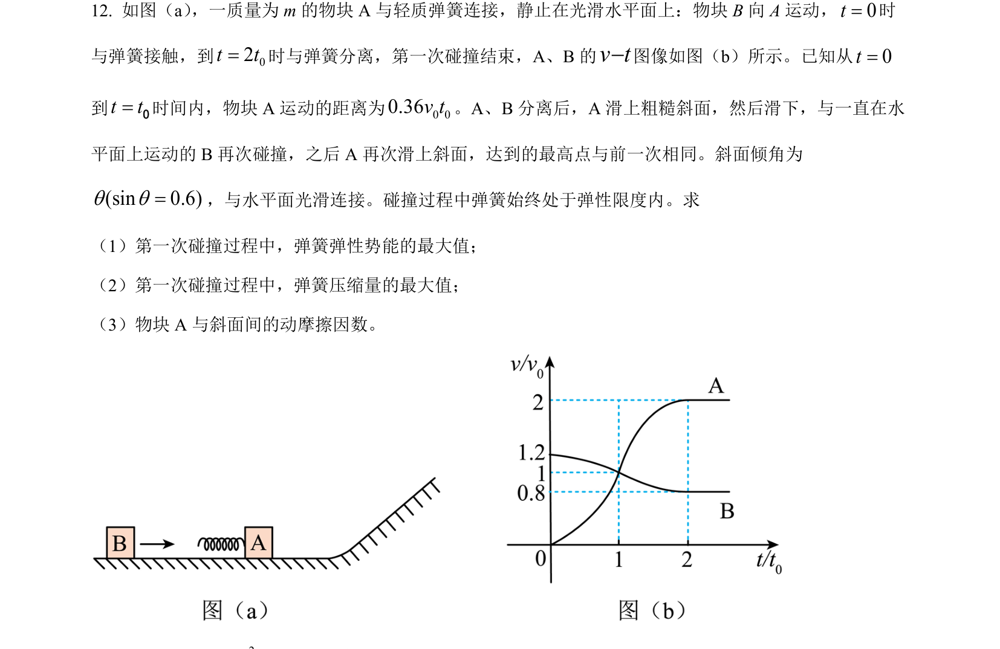
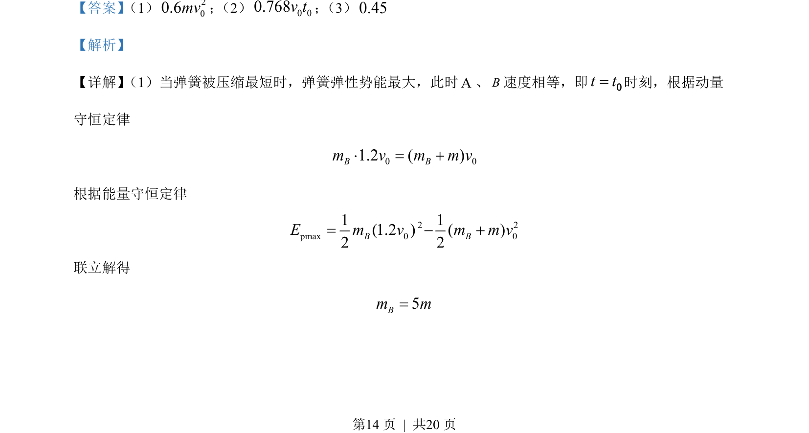
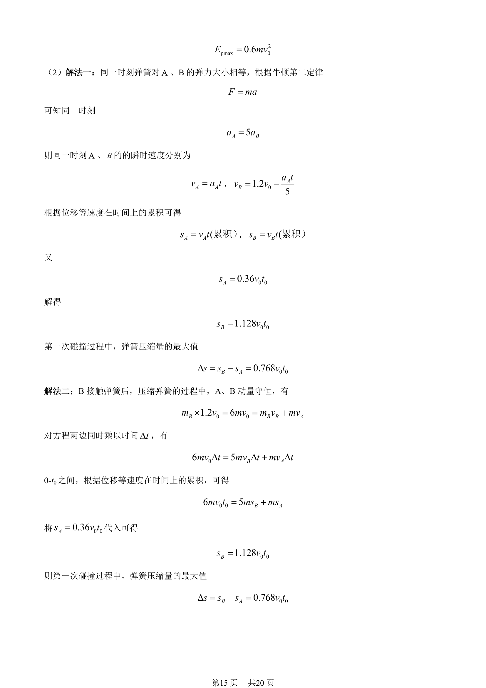
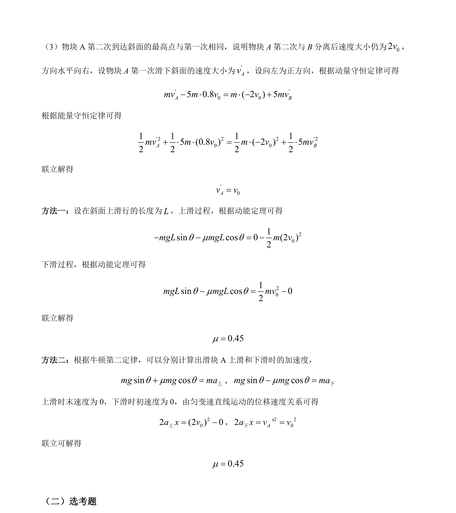

## 题面

## 摘要

本题为动量守恒与能量守恒综合应用，涉及弹簧压缩、碰撞、斜面运动等多过程分析。

## 关联考点

- [[347-动量守恒定律|动量守恒定律]]
- [[197-能量守恒定律|能量守恒定律]]
- [[607-弹簧弹性势能|弹簧弹性势能]]
- [[229-牛顿第二定律|牛顿第二定律]]

## 答案与解析

> 📄 原 PDF 第 14 页：`素材/真题/吉林/2008-2024·（吉林）物理高考真题/2022年高考物理试卷（全国乙卷）（解析卷）.pdf`

<!-- 题干文本-start -->
## 题干文本
12. 如图（a） ，一质量为m 的物块 A 与轻质弹簧连接，静止在光滑水平面上：物块 B向 A运动，0=t时
与弹簧接触，到02t t=时与弹簧分离，第一次碰撞结束，A、B的v t-图像如图（b）所示。已知从0=t
到t t=0时间内，物块 A 运动的距离为 0 00.36v t。A、B分离后，A 滑上粗糙斜面，然后滑下，与一直在水
平面上运动的 B再次碰撞，之后 A 再次滑上斜面，达到的最高点与前一次相同。斜面倾角为
(sin 0.6)q q=，与水平面光滑连接。碰撞过程中弹簧始终处于弹性限度内。求
（1）第一次碰撞过程中，弹簧弹性势能的最大值；
（2）第一次碰撞过程中，弹簧压缩量的最大值；
（3）物块 A 与斜面间的动摩擦因数。
<!-- 题干文本-end -->

<!-- 解析文本-start -->
## 解析文本
【答案】 （1） 200.6mv； （2） 0 00.768v t； （3）0.45
【解析】
【详解】 （1）当弹簧被压缩最短时，弹簧弹性势能最大，此时A、B速度相等，即t t=0时刻，根据动量
守恒定律
0 01.2 ( )B Bm v m m v = +
根据能量守恒定律
2 2pmax 0 01 1(1.2 ) ( )2 2B BE m v m m v= - +
联立解得
5Bm m=
<!-- 解析文本-end -->
