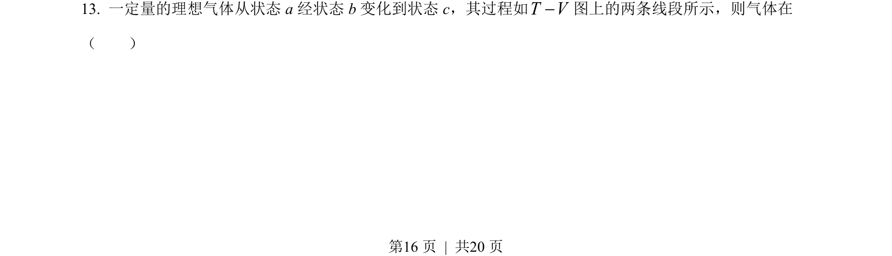
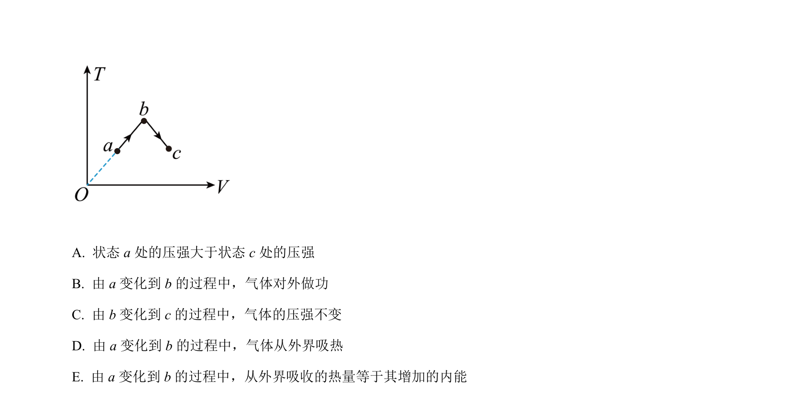
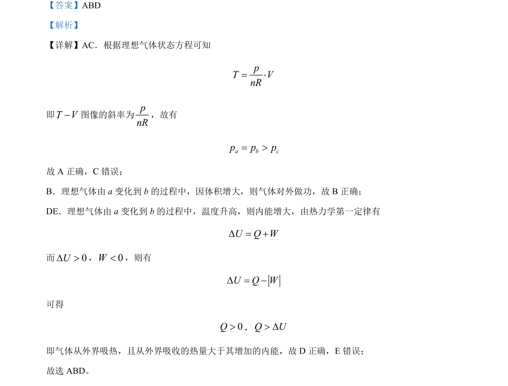

## 题面

## 摘要

本题通过理想气体状态方程和热力学第一定律分析气体状态变化过程中各物理量的关系。

## 关联考点

- [[446-理想气体状态方程|理想气体状态方程]]
- [[440-热力学第一定律|热力学第一定律]]
- [[127-内能|内能]]
- [[气体做功]]

## 答案与解析

> 📄 原 PDF 第 16 页：`素材/真题/吉林/2008-2024·（吉林）物理高考真题/2022年高考物理试卷（全国乙卷）（解析卷）.pdf`
