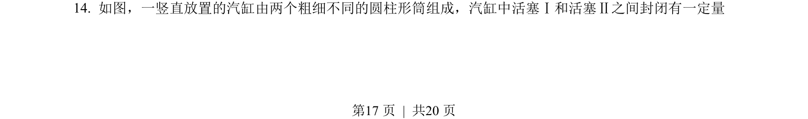
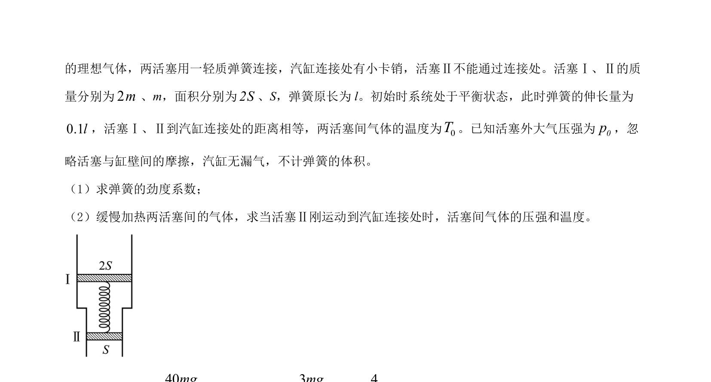
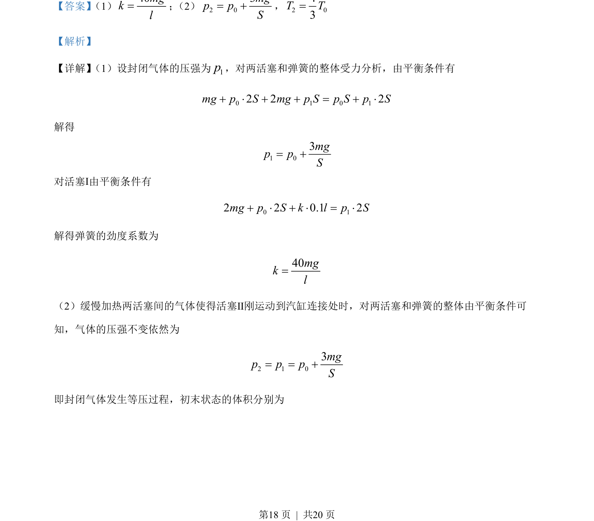
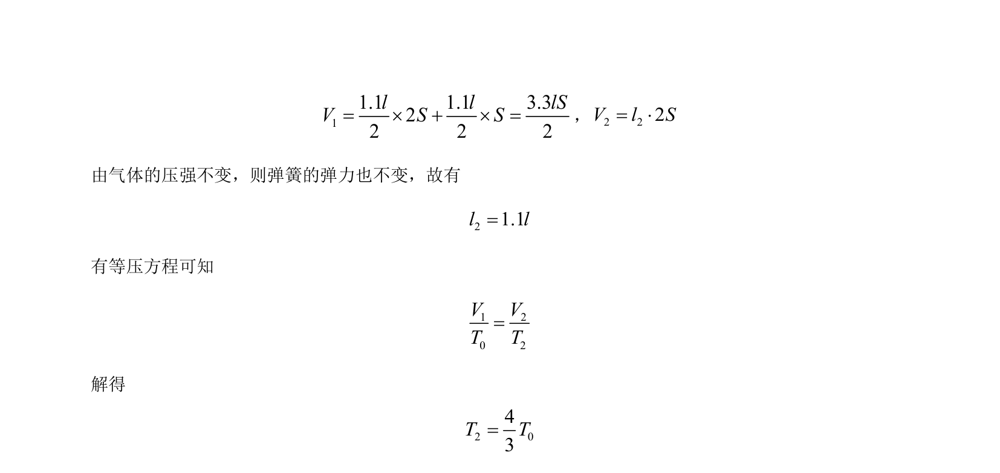

## 题面

## 摘要

该题考查理想气体等压变化与气缸活塞受力平衡的综合应用，涉及气体状态方程和弹簧问题。

## 关联考点

- [[气体实验定律]]
- [[受力平衡]]
- [[等压过程]]
- [[整体法隔离法]]

## 答案与解析

> 📄 原 PDF 第 17 页：`素材/真题/吉林/2008-2024·（吉林）物理高考真题/2022年高考物理试卷（全国乙卷）（解析卷）.pdf`
