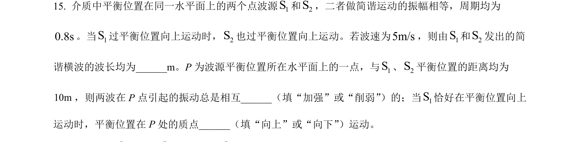
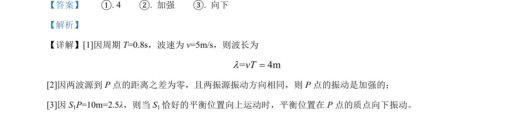

## 题面

## 摘要

考查机械波波长计算与波的干涉现象，判断质点振动方向及振动加强条件。

## 关联考点

- [[370-波长|波长]]
- [[600-干涉|干涉]]
- [[765-质点振动方向|质点振动方向]]

## 答案与解析

> 📄 原 PDF 第 19 页：`素材/真题/吉林/2008-2024·（吉林）物理高考真题/2022年高考物理试卷（全国乙卷）（解析卷）.pdf`
