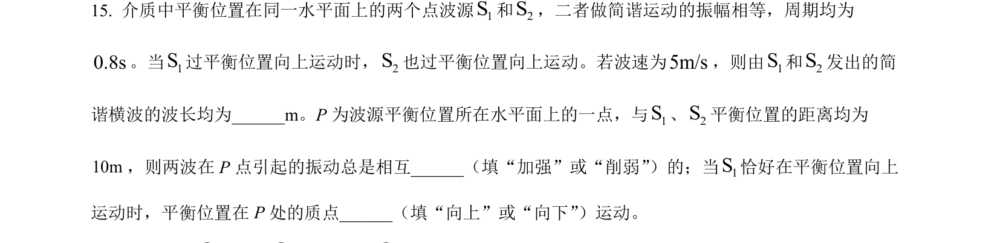
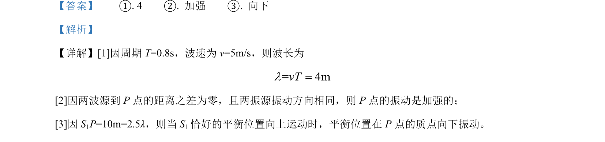

## 题面

## 摘要

考查机械波波长计算与波的干涉现象，判断质点振动方向及振动加强条件。

## 关联考点

- [[370-波长|波长]]
- [[600-干涉|干涉]]
- [[764-质点振动方向|质点振动方向]]

## 答案与解析

> 📄 原 PDF 第 19 页：`素材/真题/吉林/2008-2024·（吉林）物理高考真题/2022年高考物理试卷（全国乙卷）（解析卷）.pdf`

<!-- 题干文本-start -->
## 题干文本
15. 介质中平衡位置在同一水平面上的两个点波源1S和2S，二者做简谐运动的振幅相等，周期均为
0.8s。当1S过平衡位置向上运动时，2S也过平衡位置向上运动。若波速为5m/s，则由1S和2S发出的简
谐横波的波长均为______m。P为波源平衡位置所在水平面上的一点，与1S、2S平衡位置的距离均为
10m，则两波在 P点引起的振动总是相互______（填“加强”或“削弱”）的；当1S恰好在平衡位置向上
运动时，平衡位置在 P处的质点______（填“向上”或“向下”）运动。
<!-- 题干文本-end -->

<!-- 解析文本-start -->
## 解析文本
【答案】    ①. 4    ②. 加强    ③. 向下
【解析】
【详解】[1]因周期 T=0.8s，波速为 v=5m/s，则波长为
= 4mvTl=
[2]因两波源到 P点的距离之差为零，且两振源振动方向相同，则 P点的振动是加强的；
[3]因 S1P=10m=2.5λ，则当 S1恰好的平衡位置向上运动时，平衡位置在 P点的质点向下振动。
<!-- 解析文本-end -->
