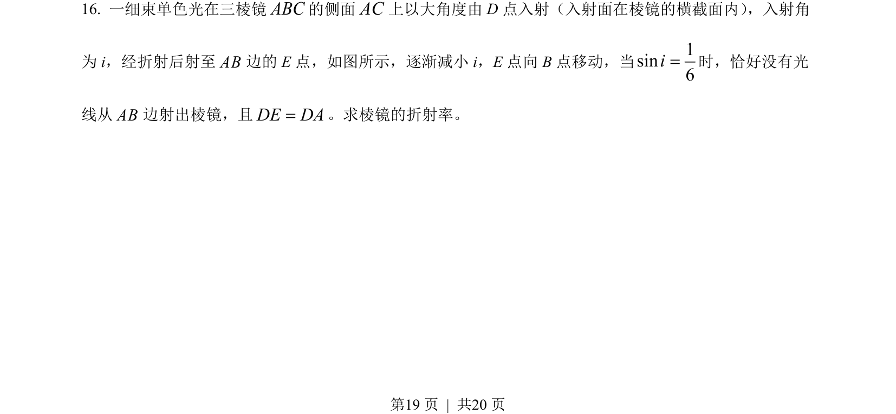
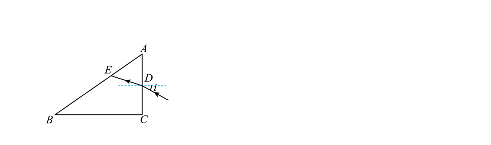
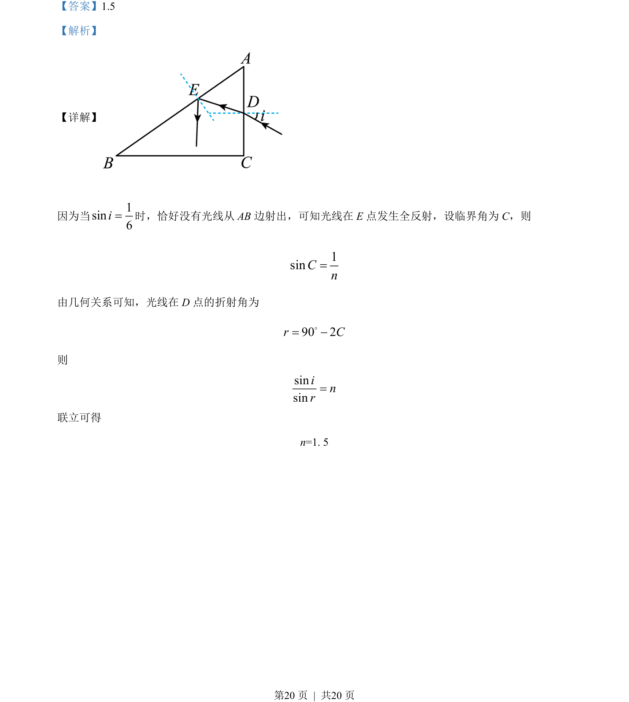

## 题面

## 摘要

光线从AB边全反射，通过临界角和折射定律计算介质折射率。

## 关联考点

- [[343-全反射|全反射]]
- [[026-折射定律|折射定律]]
- [[336-临界角|临界角]]

## 答案与解析

> 📄 原 PDF 第 19 页：`素材/真题/吉林/2008-2024·（吉林）物理高考真题/2022年高考物理试卷（全国乙卷）（解析卷）.pdf`
