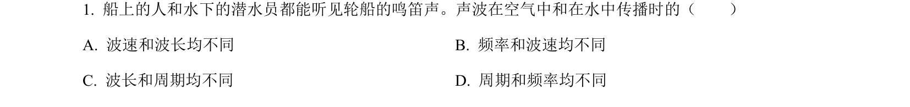
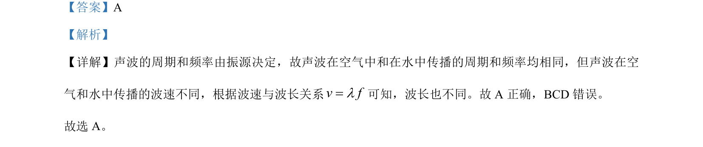

## 题面

## 摘要

声波在不同介质中传播时频率和周期不变，波速和波长不同

## 关联考点

- [[261-周期|周期]]
- [[143-频数分布|频率]]
- [[369-波速|波速]]
- [[370-波长|波长]]

## 答案与解析

> 📄 原 PDF 第 1 页：`素材/真题/吉林/2008-2024·（吉林）物理高考真题/2023年高考物理试卷（新课标）（解析卷）.pdf`
