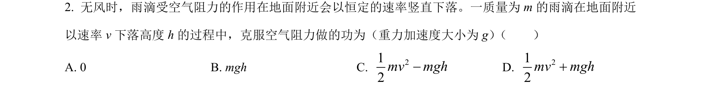
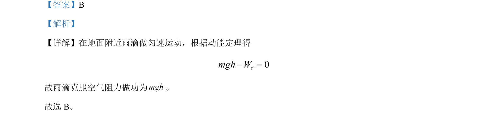

## 题面

## 摘要

雨滴匀速下落时，利用动能定理求克服空气阻力做功的大小。

## 关联考点

- [[251-动能定理|动能定理]]
- [[062-功-物理|功]]
- [[010-匀速直线运动|匀速直线运动]]

## 答案与解析

> 📄 原 PDF 第 1 页：`素材/真题/吉林/2008-2024·（吉林）物理高考真题/2023年高考物理试卷（新课标）（解析卷）.pdf`
