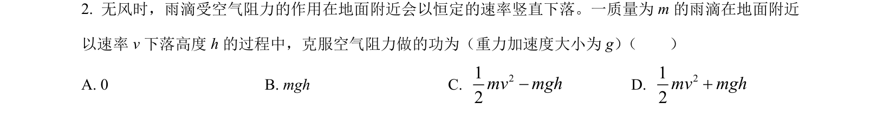
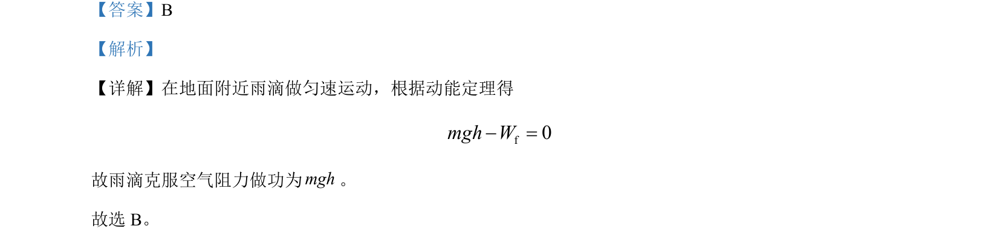

## 题面

## 摘要

雨滴匀速下落时，利用动能定理求克服空气阻力做功的大小。

## 关联考点

- [[251-动能定理|动能定理]]
- [[062-功-物理|功]]
- [[010-匀速直线运动|匀速直线运动]]

## 答案与解析

> 📄 原 PDF 第 1 页：`素材/真题/吉林/2008-2024·（吉林）物理高考真题/2023年高考物理试卷（新课标）（解析卷）.pdf`

<!-- 题干文本-start -->
## 题干文本
2. 无风时，雨滴受空气阻力的作用在地面附近会以恒定的速率竖直下落。一质量为 m 的雨滴在地面附近
以速率 v下落高度 h 的过程中，克服空气阻力做的功为（重力加速度大小为 g） （　　）
A. 0 B. mghC. 212mv mgh-D. 212mv mgh+
<!-- 题干文本-end -->

<!-- 解析文本-start -->
## 解析文本
【答案】B
【解析】
【详解】在地面附近雨滴做匀速运动，根据动能定理得
f0mgh W- =
故雨滴克服空气阻力做功为mgh。
故选 B。
<!-- 解析文本-end -->
