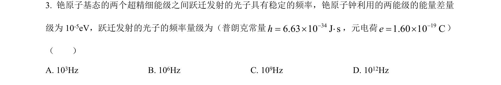
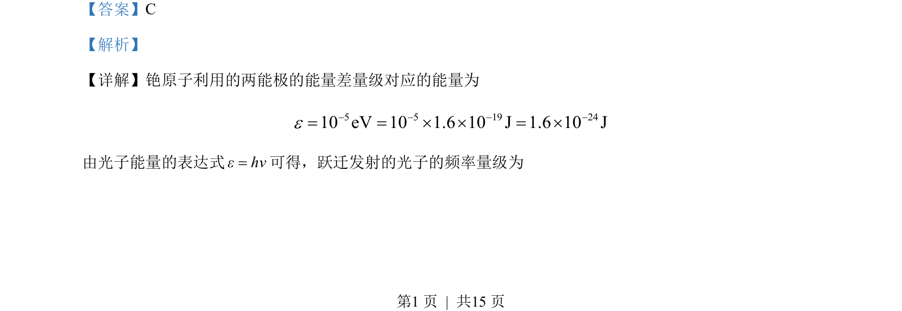

## 题面

## 摘要

通过铯原子能级能量差计算跃迁光子频率的数量级。

## 关联考点

- [[719-能级跃迁|能级跃迁]]
- [[453-光子能量|光子能量]]
- [[750-频率计算|频率计算]]

## 答案与解析

> 📄 原 PDF 第 1 页：`素材/真题/吉林/2008-2024·（吉林）物理高考真题/2023年高考物理试卷（新课标）（解析卷）.pdf`

<!-- 题干文本-start -->
## 题干文本
3. 铯原子基态的两个超精细能级之间跃迁发射的光子具有稳定的频率，铯原子钟利用的两能级的能量差量
级为 10-5eV，跃迁发射的光子的频率量级为（普朗克常量 346.63 10 J s-= ´ ×h，元电荷 191.6010Ce-=´）
（　　）
A. 103Hz B. 10 6Hz C. 10 9Hz D. 10 12Hz
<!-- 题干文本-end -->

<!-- 解析文本-start -->
## 解析文本
【答案】C
【解析】
【详解】铯原子利用的两能极的能量差量级对应的能量为
5 5 19 2410 eV 10 1.6 10 J 1.6 10 Je- - - -= = ´ ´ = ´
由光子能量的表达式εhν=可得，跃迁发射的光子的频率量级为
<!-- 解析文本-end -->
