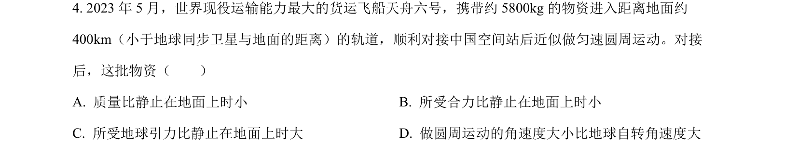
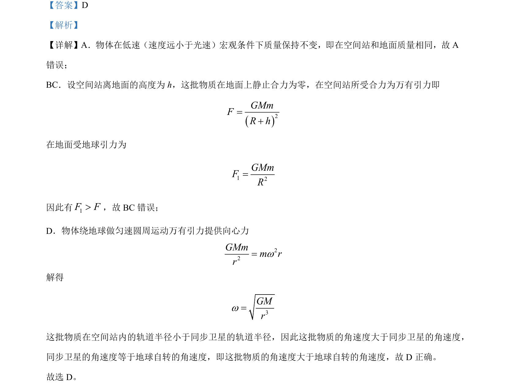

## 题面

## 摘要

该题辨析物体在空间站与地面的质量、引力及圆周运动角速度大小关系。

## 关联考点

- [[246-万有引力定律|万有引力定律]]
- [[253-匀速圆周运动|匀速圆周运动]]
- [[727-质量不变性|质量不变性]]
- [[724-角速度与轨道半径|角速度与轨道半径]]

## 答案与解析

> 📄 原 PDF 第 2 页：`素材/真题/吉林/2008-2024·（吉林）物理高考真题/2023年高考物理试卷（新课标）（解析卷）.pdf`
