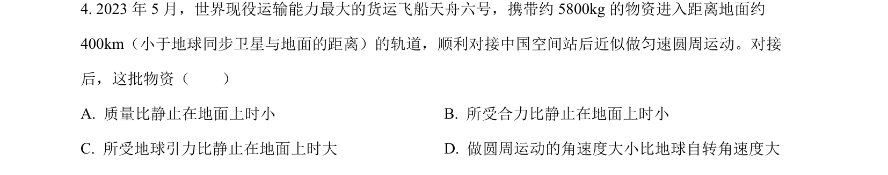
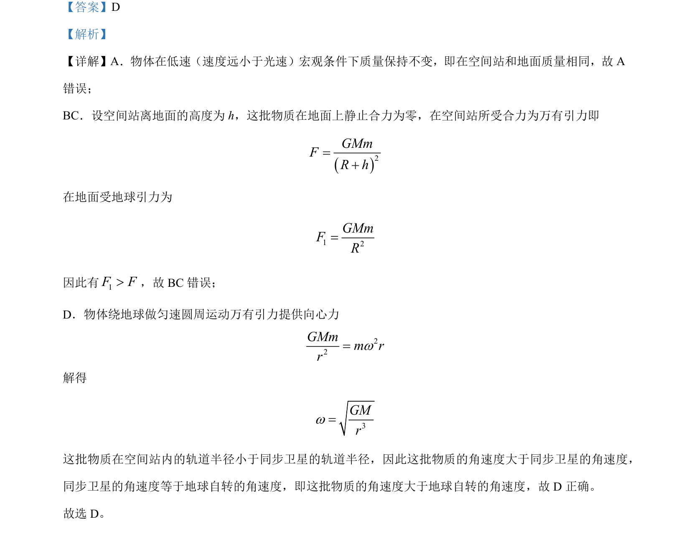

## 题面

## 摘要

该题辨析物体在空间站与地面的质量、引力及圆周运动角速度大小关系。

## 关联考点

- [[246-万有引力定律|万有引力定律]]
- [[253-匀速圆周运动|匀速圆周运动]]
- [[726-质量不变性|质量不变性]]
- [[723-角速度与轨道半径|角速度与轨道半径]]

## 答案与解析

> 📄 原 PDF 第 2 页：`素材/真题/吉林/2008-2024·（吉林）物理高考真题/2023年高考物理试卷（新课标）（解析卷）.pdf`

<!-- 题干文本-start -->
## 题干文本
4. 2023 年 5 月，世界现役运输能力最大的货运飞船天舟六号，携带约 5800kg 的物资进入距离地面约
400km（小于地球同步卫星与地面的距离）的轨道，顺利对接中国空间站后近似做匀速圆周运动。对接
后，这批物资（　　）
A. 质量比静止在地面上时小 B. 所受合力比静止在地面上时小
C. 所受地球引力比静止在地面上时大 D. 做圆周运动的角速度大小比地球自转角速度大
<!-- 题干文本-end -->

<!-- 解析文本-start -->
## 解析文本
【答案】D
【解析】
【详解】A．物体在低速（速度远小于光速）宏观条件下质量保持不变，即在空间站和地面质量相同，故A
错误；
BC．设空间站离地面的高度为 h，这批物质在地面上静止合力为零，在空间站所受合力为万有引力即
2GMmFR h=+
在地面受地球引力为
12GMmFR=
因此有1F F>，故 BC 错误；
D．物体绕地球做匀速圆周运动万有引力提供向心力
22GMmm rrw=
解得
3GMrw=
这批物质在空间站内的轨道半径小于同步卫星的轨道半径，因此这批物质的角速度大于同步卫星的角速度，
同步卫星的角速度等于地球自转的角速度，即这批物质的角速度大于地球自转的角速度，故 D 正确。
故选 D。
<!-- 解析文本-end -->
