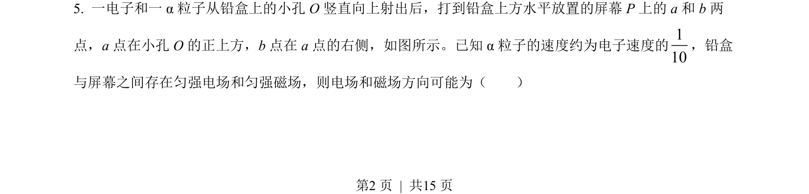
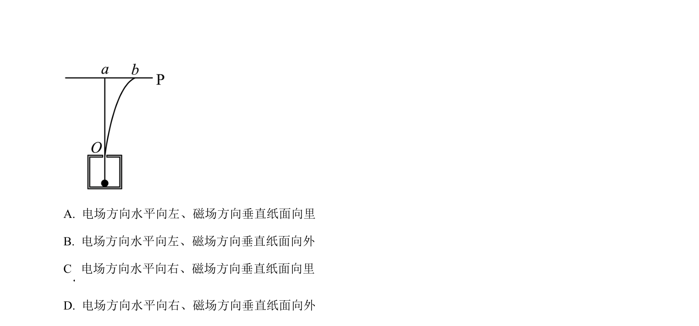
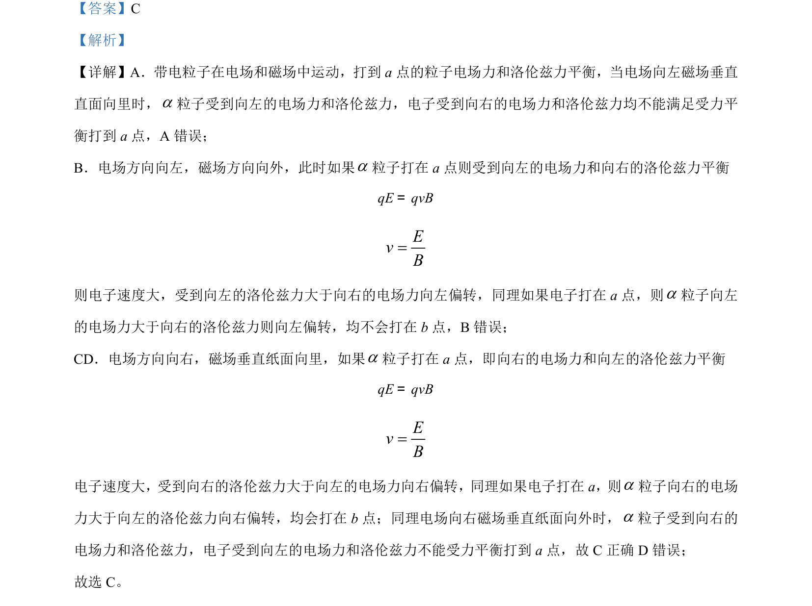

## 题面

## 摘要

带电粒子在电磁场中受力平衡与偏转方向分析

## 关联考点

- [[672-电场力|电场力]]
- [[304-洛伦兹力|洛伦兹力]]
- [[554-受力平衡|受力平衡]]

## 答案与解析

> 📄 原 PDF 第 2 页：`素材/真题/吉林/2008-2024·（吉林）物理高考真题/2023年高考物理试卷（新课标）（解析卷）.pdf`

<!-- 题干文本-start -->
## 题干文本
5. 一电子和一 α粒子从铅盒上的小孔 O 竖直向上射出后，打到铅盒上方水平放置的屏幕 P上的 a 和 b 两
点，a 点在小孔 O 的正上方，b 点在 a 点的右侧，如图所示。已知 α粒子的速度约为电子速度的110
，铅盒
与屏幕之间存在匀强电场和匀强磁场，则电场和磁场方向可能为（　　）
<!-- 题干文本-end -->

<!-- 解析文本-start -->
## 解析文本

<!-- 解析文本-end -->
