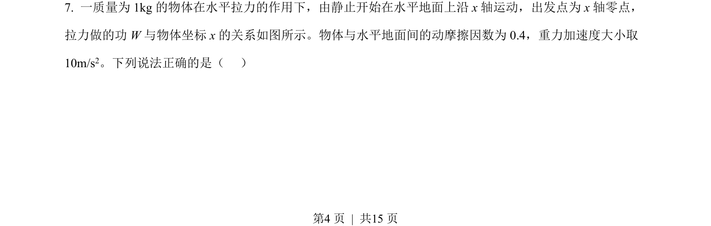
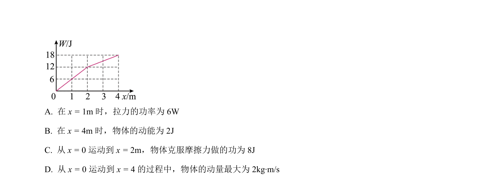
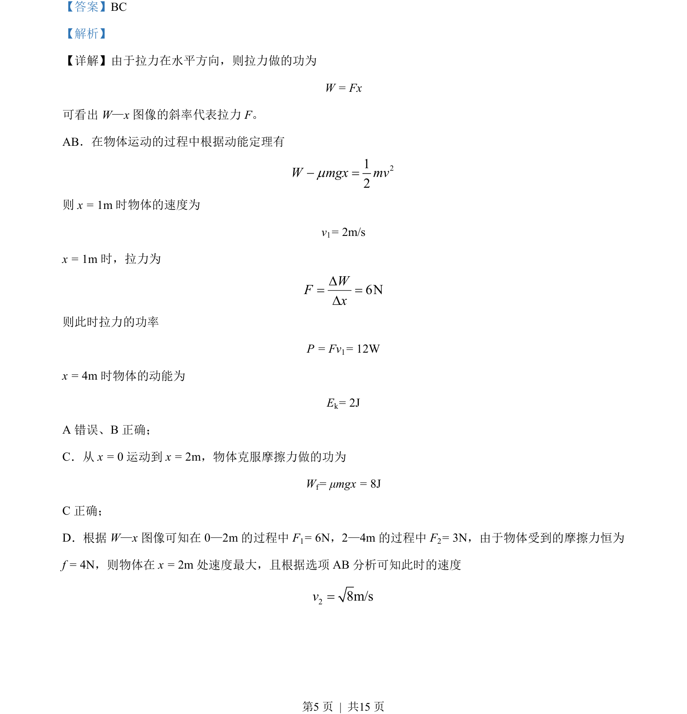
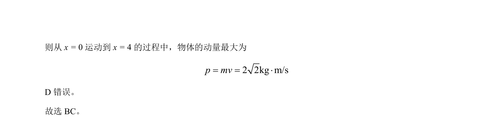

## 题面

## 摘要

通过W-x图像分析拉力做功、动能、速度、功率和动量变化。

## 关联考点

- [[062-功-物理|功]]
- [[251-动能定理|动能定理]]
- [[063-功率|功率]]
- [[346-动量|动量]]

## 答案与解析

> 📄 原 PDF 第 4 页：`素材/真题/吉林/2008-2024·（吉林）物理高考真题/2023年高考物理试卷（新课标）（解析卷）.pdf`
