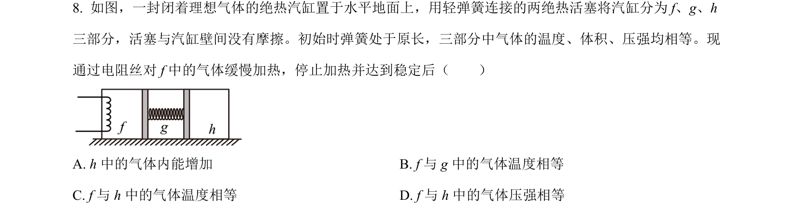
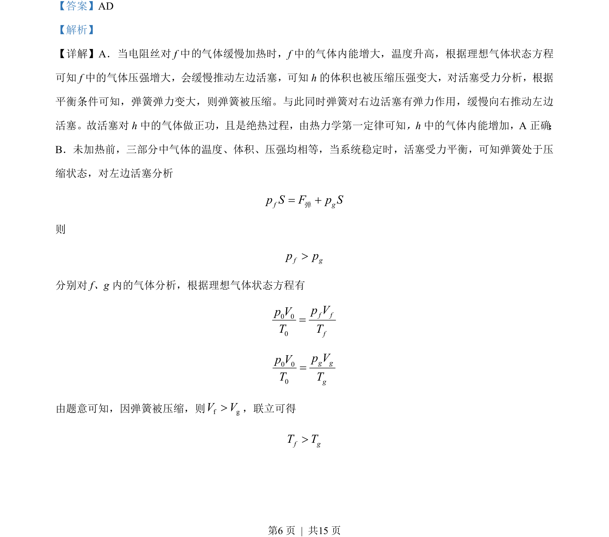
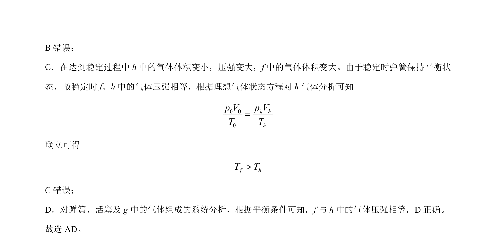

## 题面

## 摘要

考查理想气体状态方程、热力学第一定律及活塞弹簧受力平衡的综合判断。

## 关联考点

- [[446-理想气体状态方程|理想气体状态方程]]
- [[440-热力学第一定律|热力学第一定律]]
- [[554-受力平衡|受力平衡]]

## 答案与解析

> 📄 原 PDF 第 6 页：`素材/真题/吉林/2008-2024·（吉林）物理高考真题/2023年高考物理试卷（新课标）（解析卷）.pdf`
