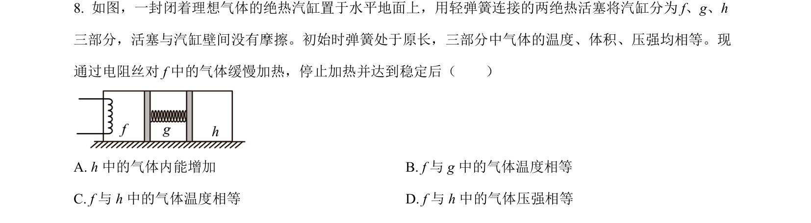
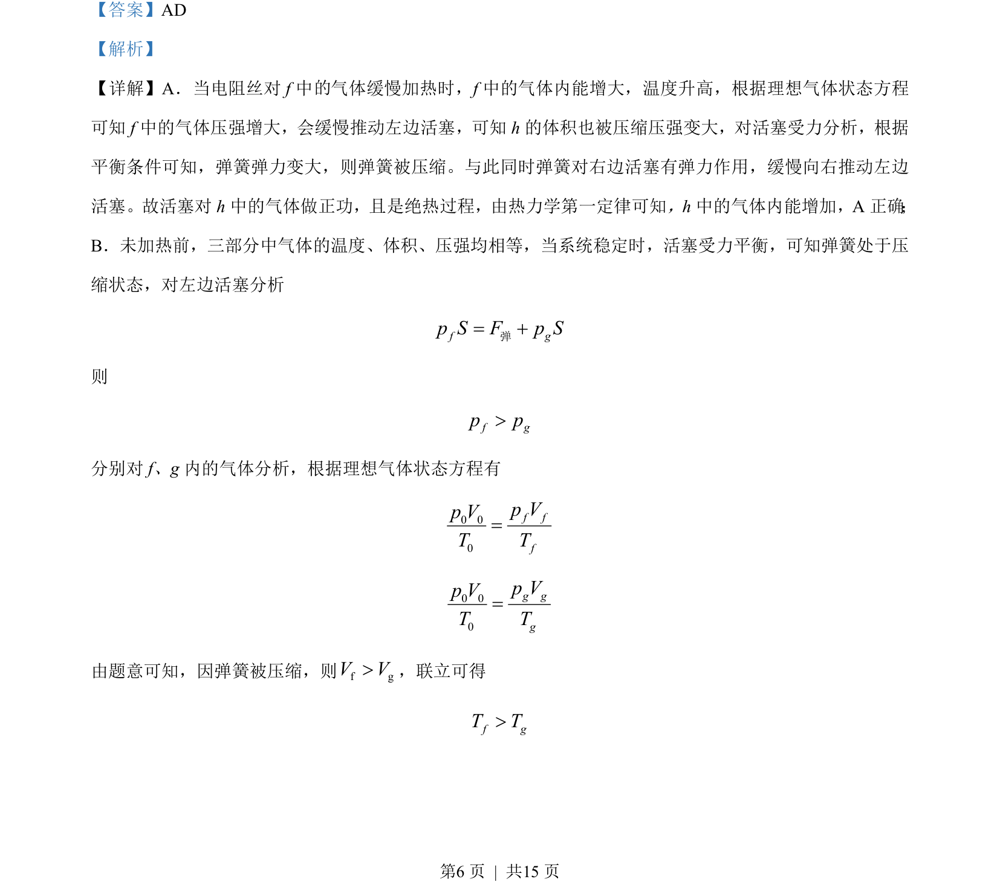
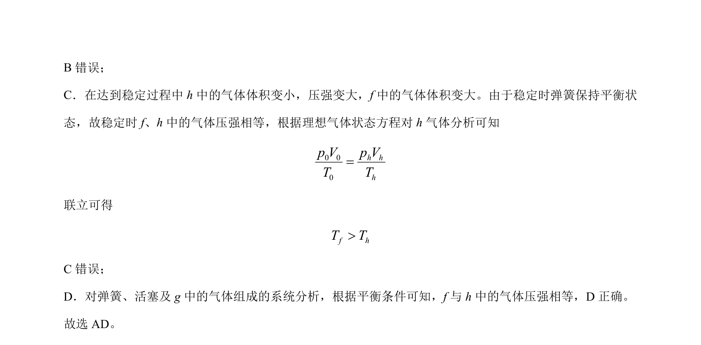

## 题面

## 摘要

考查理想气体状态方程、热力学第一定律及活塞弹簧受力平衡的综合判断。

## 关联考点

- [[446-理想气体状态方程|理想气体状态方程]]
- [[440-热力学第一定律|热力学第一定律]]
- [[554-受力平衡|受力平衡]]

## 答案与解析

> 📄 原 PDF 第 6 页：`素材/真题/吉林/2008-2024·（吉林）物理高考真题/2023年高考物理试卷（新课标）（解析卷）.pdf`

<!-- 题干文本-start -->
## 题干文本
8. 如图，一封闭着理想气体的绝热汽缸置于水平地面上，用轻弹簧连接的两绝热活塞将汽缸分为 f、g、h
三部分，活塞与汽缸壁间没有摩擦。初始时弹簧处于原长，三部分中气体的温度、体积、压强均相等。现
通过电阻丝对 f中的气体缓慢加热，停止加热并达到稳定后（　　）
  
A. h 中的气体内能增加 B. f与 g 中的气体温度相等
C. f与 h中的气体温度相等 D. f 与 h 中的气体压强相等
<!-- 题干文本-end -->

<!-- 解析文本-start -->
## 解析文本
【答案】AD
【解析】
【详解】A．当电阻丝对 f 中 气体缓慢加热时， f 中的气体内能增大，温度升高，根据理想气体状态方程
可知 f中的气体压强增大，会缓慢推动左边活塞，可知h的体积也被压缩压强变大，对活塞受力分析，根据
平衡条件可知，弹簧弹力变大，则弹簧被压缩。与此同时弹簧对右边活塞有弹力作用，缓慢向右推动左边
活塞。故活塞对 h 中的气体做正功，且是绝热过程，由热力学第一定律可知，h 中的气体内能增加，A 正确 ；
B．未加热前，三部分中气体的温度、体积、压强均相等，当系统稳定时，活塞受力平衡，可知弹簧处于压
缩状态，对左边活塞分析
f gp S F p S= +弹
则
f gp p>
分别对 f、g 内的气体分析，根据理想气体状态方程有
0 00f ffp Vp VT T=0 00g ggp Vp VT T=
由题意可知，因弹簧被压缩，则f gV V>，联立可得
f gT T>
的
<!-- 解析文本-end -->
