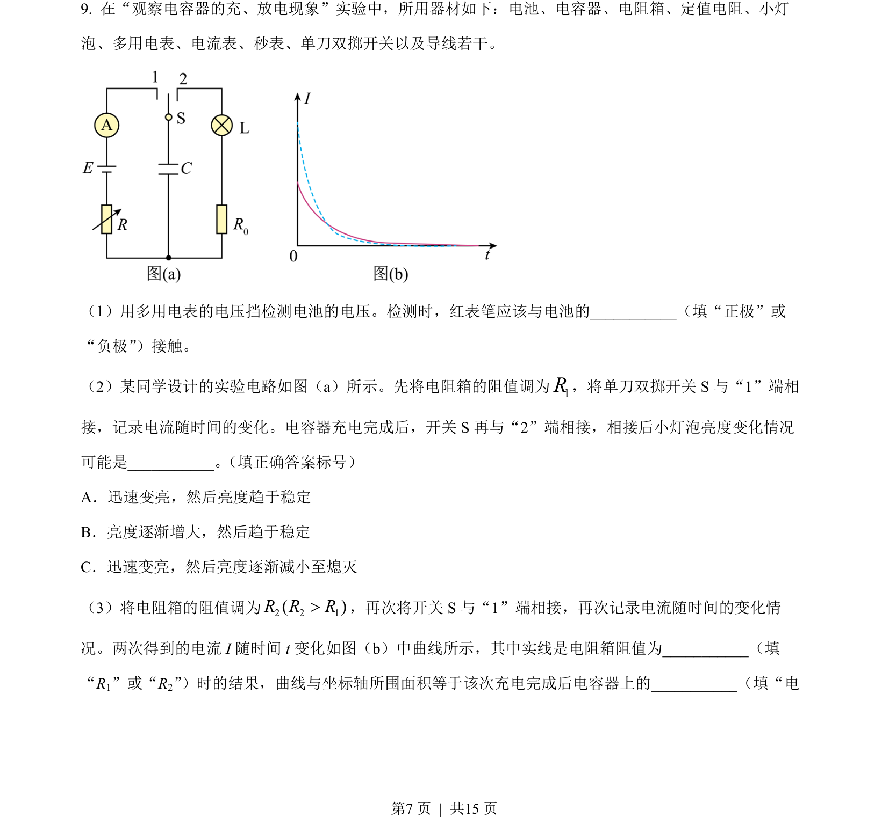
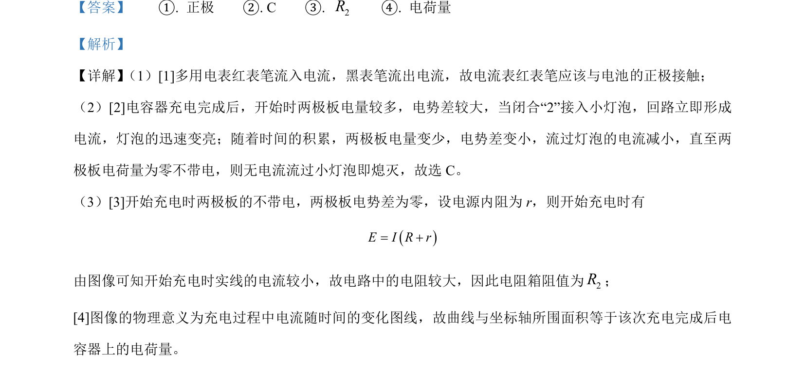

## 题面

## 摘要

本题通过多用电表原理和电容器充放电实验，考查电路分析及电流-时间图像的面积意义。

## 关联考点

- [[693-电路分析|电路分析]]
- [[676-电容器充放电|电容器充放电]]
- [[567-图像面积意义|图像面积意义]]

## 答案与解析

> 📄 原 PDF 第 7 页：`素材/真题/吉林/2008-2024·（吉林）物理高考真题/2023年高考物理试卷（新课标）（解析卷）.pdf`

<!-- 题干文本-start -->
## 题干文本
9. 在“观察电容器的充、放电现象”实验中，所用器材如下：电池、电容器、电阻箱、定值电阻、小灯
泡、多用电表、电流表、秒表、单刀双掷开关以及导线若干。
  
（1）用多用电表的电压挡检测电池的电压。检测时，红表笔应该与电池的___________（填“正极”或
“负极”）接触。
（2）某同学设计的实验电路如图（a）所示。先将电阻箱的阻值调为1R，将单刀双掷开关 S 与“1”端相
接，记录电流随时间的变化。电容器充电完成后，开关 S 再与“2”端相接，相接后小灯泡亮度变化情况
可能是___________。 （填正确答案标号）
A．迅速变亮，然后亮度趋于稳定
B．亮度逐渐增大，然后趋于稳定
C．迅速变亮，然后亮度逐渐减小至熄灭
（3）将电阻箱的阻值调为2 2 1( )R R R>，再次将开关 S 与“1”端相接，再次记录电流随时间的变化情
况。两次得到的电流 I 随时间 t变化如图（b）中曲线所示，其中实线是电阻箱阻值为___________（填
“R1”或“R2”）时的结果，曲线与坐标轴所围面积等于该次充电完成后电容器上的___________（填“电
<!-- 题干文本-end -->

<!-- 解析文本-start -->
## 解析文本

<!-- 解析文本-end -->
