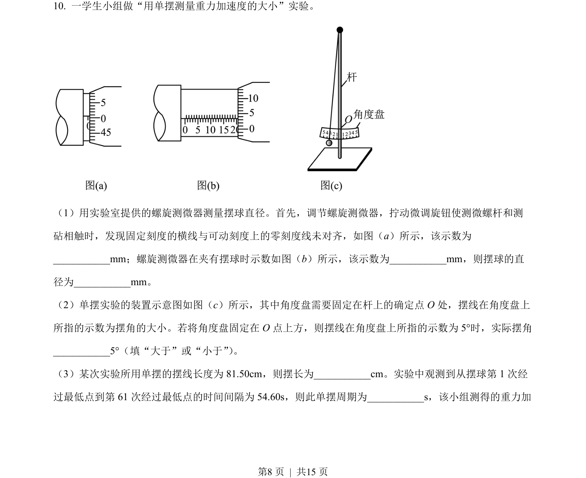
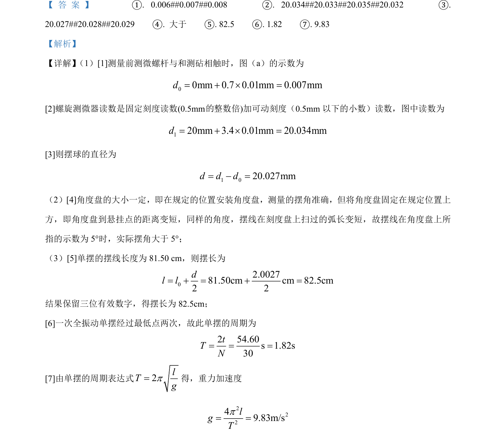

## 题面

## 摘要

本题考查螺旋测微器读数、单摆摆长与重力加速度计算及误差分析。

## 关联考点

- [[螺旋测微器读数]]
- [[有效数字]]
- [[351-单摆周期公式|单摆周期公式]]
- [[误差分析]]

## 答案与解析

> 📄 原 PDF 第 8 页：`素材/真题/吉林/2008-2024·（吉林）物理高考真题/2023年高考物理试卷（新课标）（解析卷）.pdf`
