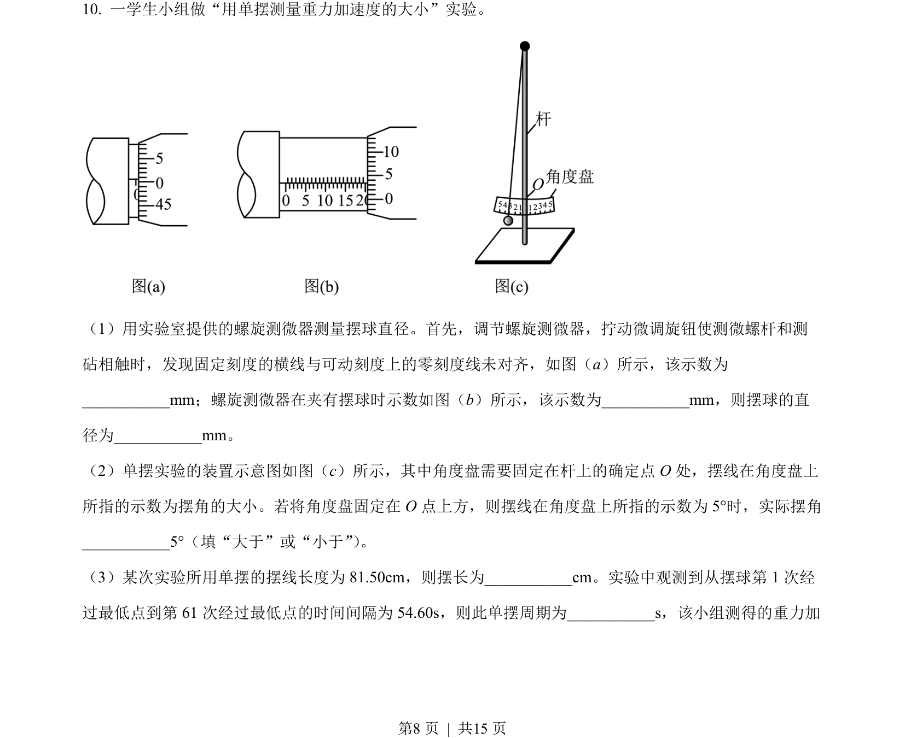
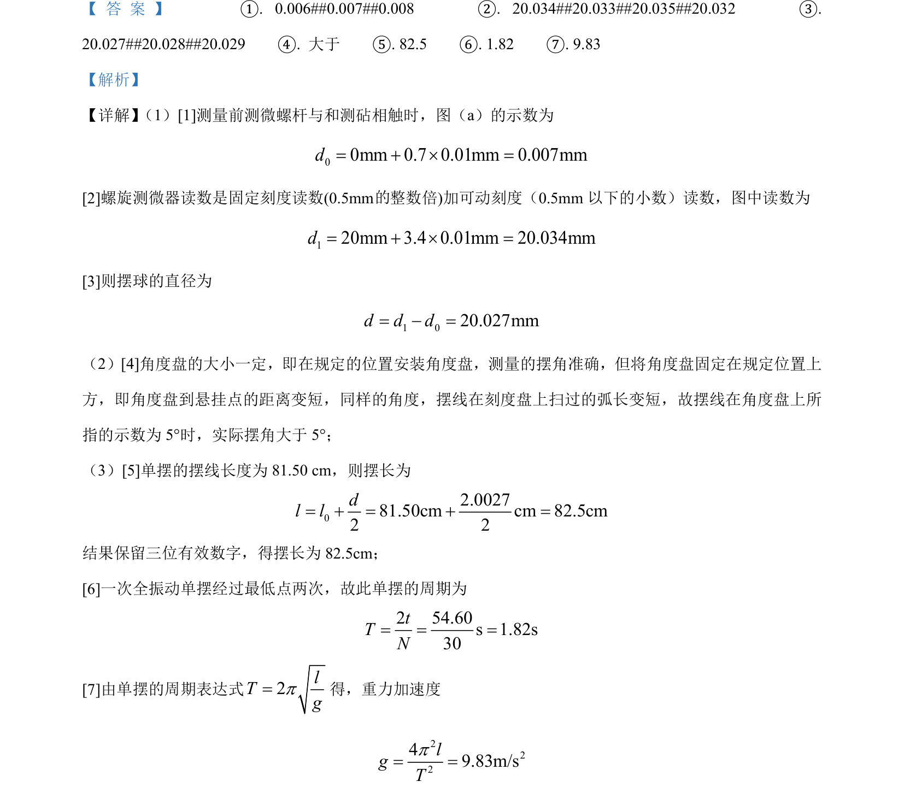

## 题面

## 摘要

本题考查螺旋测微器读数、单摆摆长与重力加速度计算及误差分析。

## 关联考点

- [[770-螺旋测微器读数|螺旋测微器读数]]
- [[625-有效数字|有效数字]]
- [[351-单摆周期公式|单摆周期公式]]
- [[724-误差分析|误差分析]]

## 答案与解析

> 📄 原 PDF 第 8 页：`素材/真题/吉林/2008-2024·（吉林）物理高考真题/2023年高考物理试卷（新课标）（解析卷）.pdf`

<!-- 题干文本-start -->
## 题干文本
10. 一学生小组做“用单摆测量重力加速度的大小”实验。
  
（1）用实验室提供的螺旋测微器测量摆球直径。首先，调节螺旋测微器，拧动微调旋钮使测微螺杆和测
砧相触时，发现固定刻度的横线与可动刻度上的零刻度线未对齐，如图（a）所示，该示数为
___________mm；螺旋测微器在夹有摆球时示数如图（b）所示，该示数为___________mm，则摆球的直
径为___________mm。
（2）单摆实验的装置示意图如图（c）所示，其中角度盘需要固定在杆上的确定点 O 处，摆线在角度盘上
所指的示数为摆角的大小。若将角度盘固定在 O 点上方，则摆线在角度盘上所指的示数为 5°时，实际摆角
___________5°（填“大于”或“小于”） 。
（3）某次实验所用单摆的摆线长度为 81.50cm，则摆长为___________cm。实验中观测到从摆球第 1 次经
过最低点到第 61 次经过最低点的时间间隔为 54.60s，则此单摆周期为___________s，该小组测得的重力加
的
<!-- 题干文本-end -->

<!-- 解析文本-start -->
## 解析文本

<!-- 解析文本-end -->
