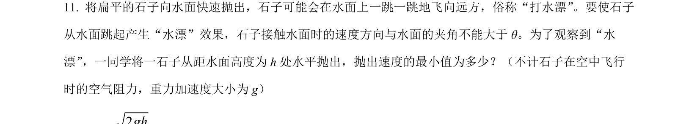
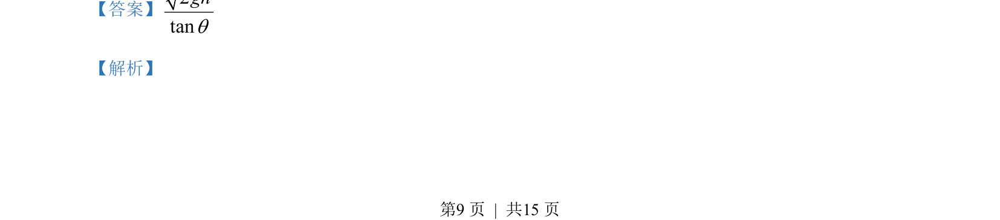
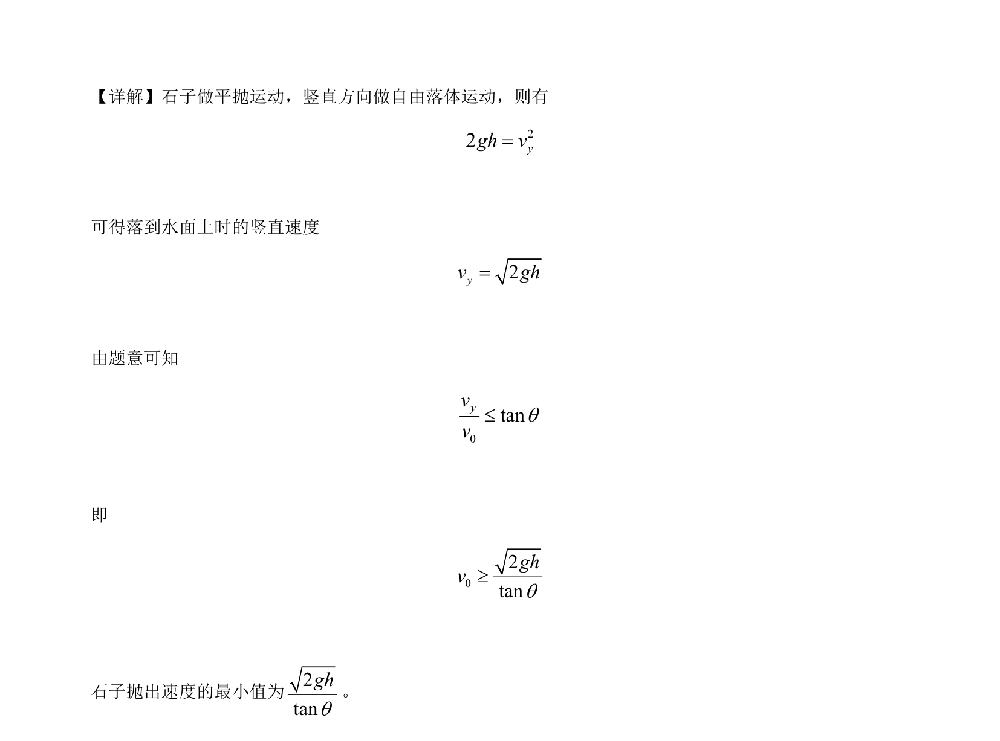

## 题面

## 摘要

本题考查平抛运动中速度方向与斜面夹角限制下求最小抛出速度。

## 关联考点

- [[261-平抛运动|平抛运动]]
- [[780-速度分解|速度分解]]
- [[506-临界条件|临界条件]]
- [[286-函数的最值|最小值]]

## 答案与解析

> 📄 原 PDF 第 9 页：`素材/真题/吉林/2008-2024·（吉林）物理高考真题/2023年高考物理试卷（新课标）（解析卷）.pdf`
