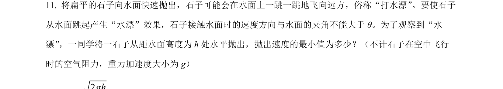
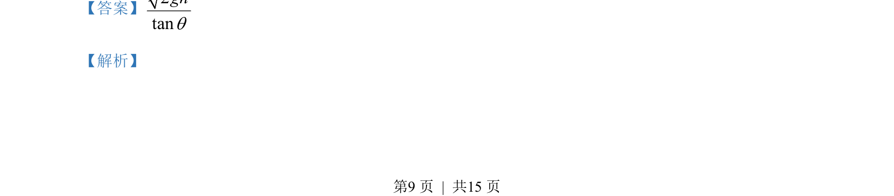
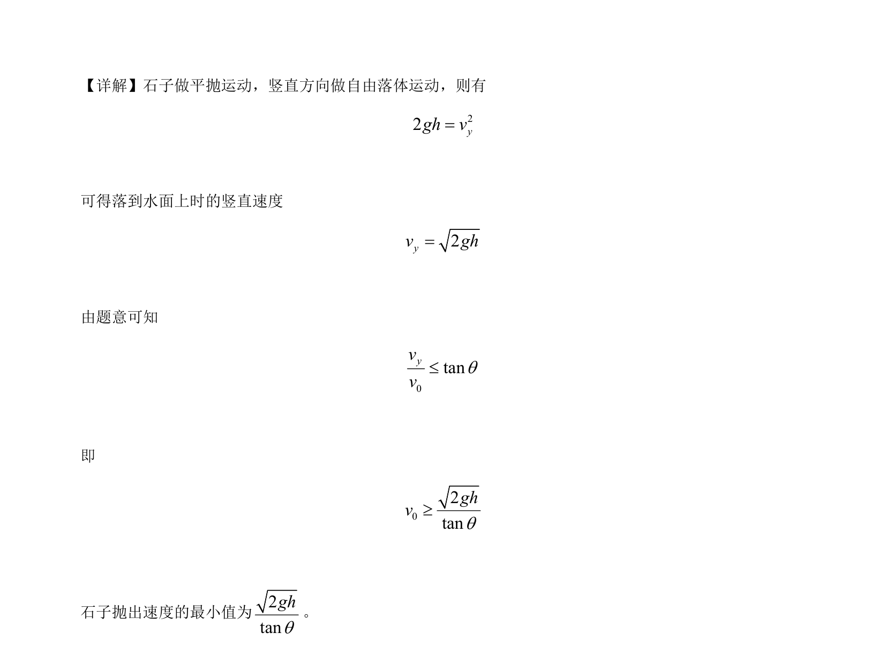

## 题面

## 摘要

本题考查平抛运动中速度方向与斜面夹角限制下求最小抛出速度。

## 关联考点

- [[261-平抛运动|平抛运动]]
- [[780-速度分解|速度分解]]
- [[506-临界条件|临界条件]]
- [[286-函数的最值|最小值]]

## 答案与解析

> 📄 原 PDF 第 9 页：`素材/真题/吉林/2008-2024·（吉林）物理高考真题/2023年高考物理试卷（新课标）（解析卷）.pdf`

<!-- 题干文本-start -->
## 题干文本
11. 将扁平的石子向水面快速抛出，石子可能会在水面上一跳一跳地飞向远方，俗称“打水漂”。要使石子
从水面跳起产生“水漂”效果，石子接触水面时的速度方向与水面的夹角不能大于 θ。为了观察到“水
漂”，一同学将一石子从距水面高度为h 处水平抛出，抛出速度的最小值为多少？（不计石子在空中飞行
时的空气阻力，重力加速度大小为 g）
<!-- 题干文本-end -->

<!-- 解析文本-start -->
## 解析文本
【答案】2tanghq
【解析】
的
<!-- 解析文本-end -->
