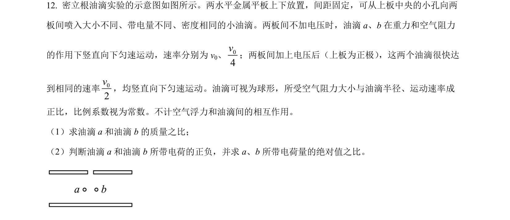
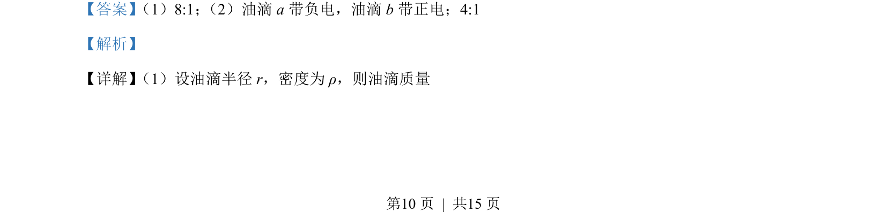
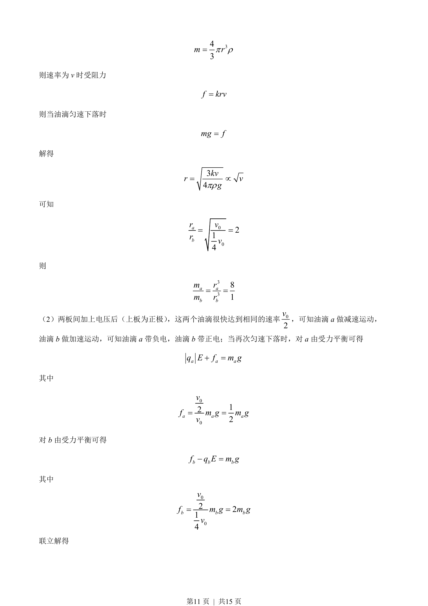

## 题面

## 摘要

油滴在重力与阻力作用下匀速下落，通过半径与质量关系分析；外加电场后判断油滴电性并计算电量比。

## 关联考点

- [[215-匀变速直线运动|匀变速直线运动]]
- [[208-共点力平衡|共点力平衡]]
- [[672-电场力|电场力]]
- [[1176-牛顿运动定律|牛顿运动定律]]

## 答案与解析

> 📄 原 PDF 第 10 页：`素材/真题/吉林/2008-2024·（吉林）物理高考真题/2023年高考物理试卷（新课标）（解析卷）.pdf`
