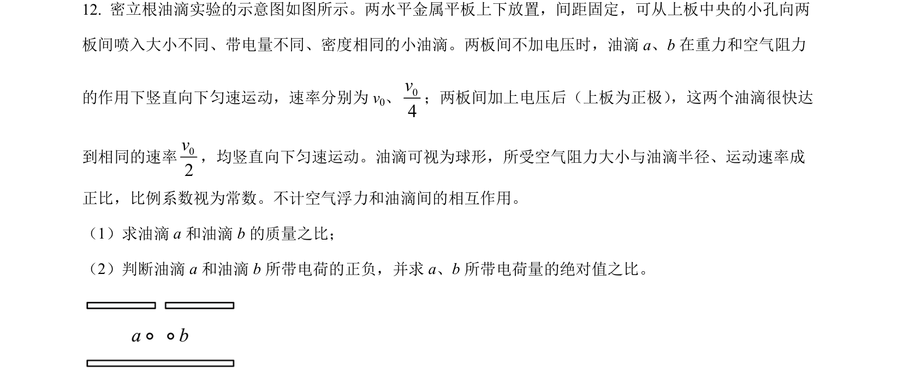
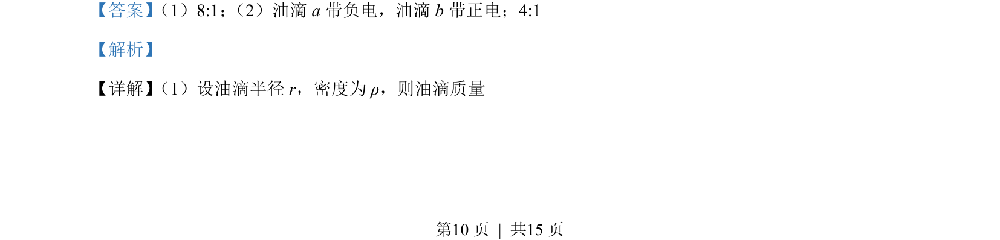
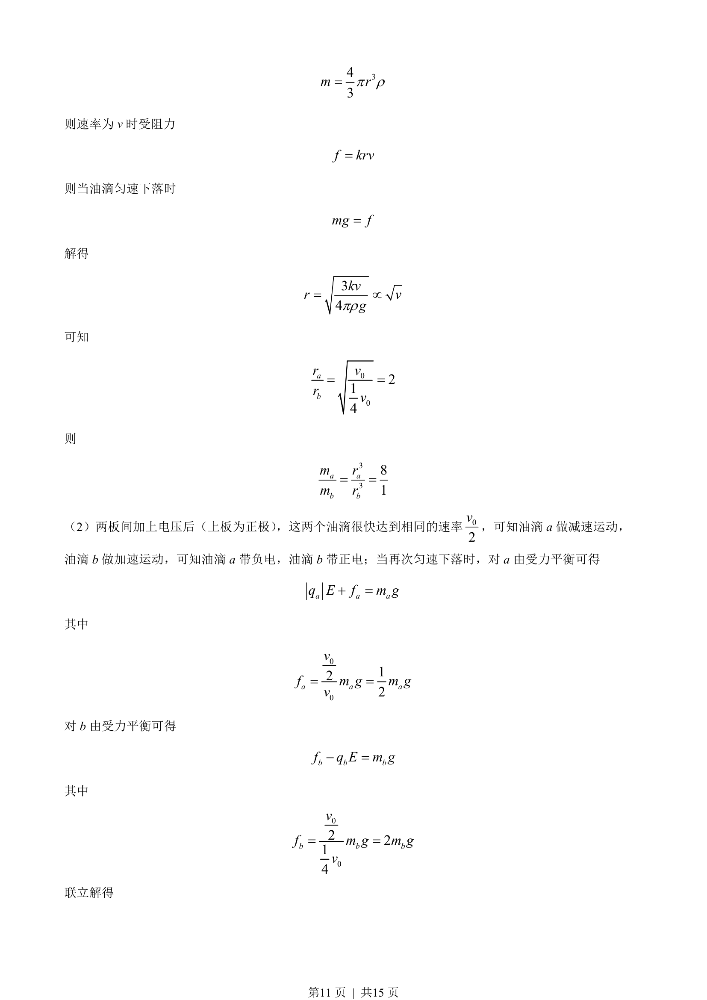

## 题面

## 摘要

油滴在重力与阻力作用下匀速下落，通过半径与质量关系分析；外加电场后判断油滴电性并计算电量比。

## 关联考点

- [[215-匀变速直线运动|匀变速直线运动]]
- [[208-共点力平衡|共点力平衡]]
- [[672-电场力|电场力]]
- [[1176-牛顿运动定律|牛顿运动定律]]

## 答案与解析

> 📄 原 PDF 第 10 页：`素材/真题/吉林/2008-2024·（吉林）物理高考真题/2023年高考物理试卷（新课标）（解析卷）.pdf`

<!-- 题干文本-start -->
## 题干文本
12. 密立根油滴实验的示意图如图所示。两水平金属平板上下放置，间距固定，可从上板中央的小孔向两
板间喷入大小不同、带电量不同、密度相同的小油滴。两板间不加电压时，油滴 a、b 在重力和空气阻力
的作用下竖直向下匀速运动，速率分别为 v0、04v；两板间加上电压后（上板为正极） ，这两个油滴很快达
到相同的速率02v，均竖直向下匀速运动。油滴可视为球形，所受空气阻力大小与油滴半径、运动速率成
正比，比例系数视为常数。不计空气浮力和油滴间的相互作用。
（1）求油滴 a 和油滴 b 的质量之比；
（2）判断油滴 a 和油滴 b 所带电荷的正负，并求 a、b 所带电荷量的绝对值之比。
<!-- 题干文本-end -->

<!-- 解析文本-start -->
## 解析文本
【答案】 （1）8:1； （2）油滴 a 带负电，油滴 b 带正电；4:1
【解析】
【详解】 （1）设油滴半径 r，密度为 ρ，则油滴质量
<!-- 解析文本-end -->
