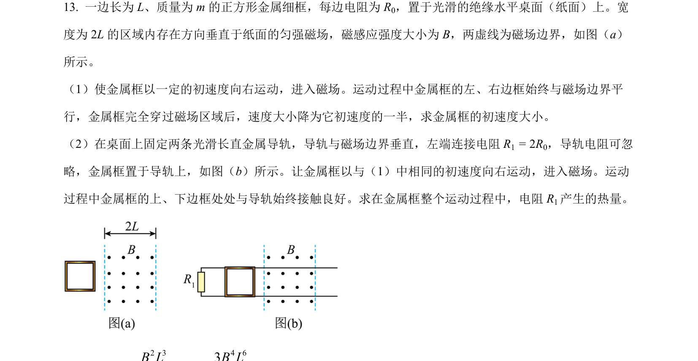
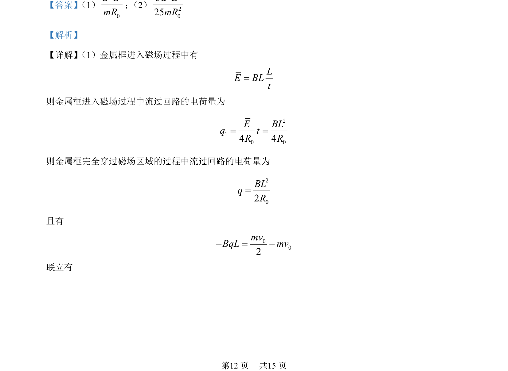
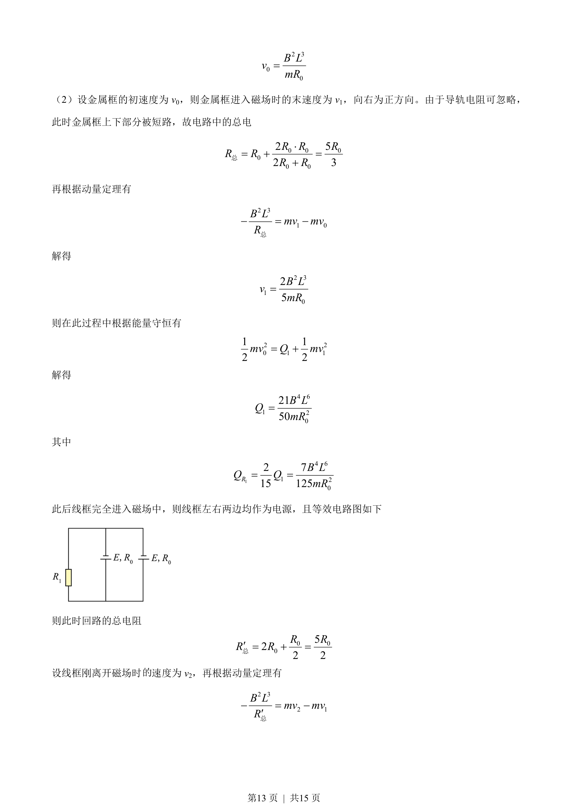
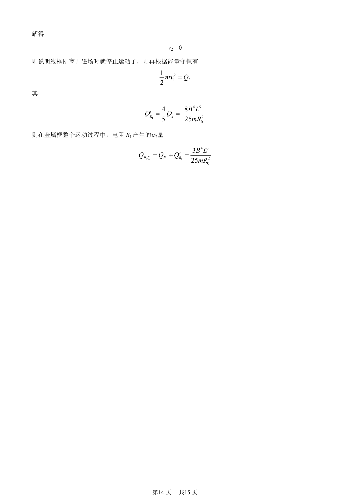

## 题面

## 摘要

金属框在磁场中运动，涉及电荷量、速度及电阻热量的计算。

## 关联考点

- [[175-电磁感应|电磁感应]]
- [[349-动量定理|动量定理]]
- [[197-能量守恒定律|能量守恒]]
- [[电路分析]]

## 答案与解析

> 📄 原 PDF 第 12 页：`素材/真题/吉林/2008-2024·（吉林）物理高考真题/2023年高考物理试卷（新课标）（解析卷）.pdf`
