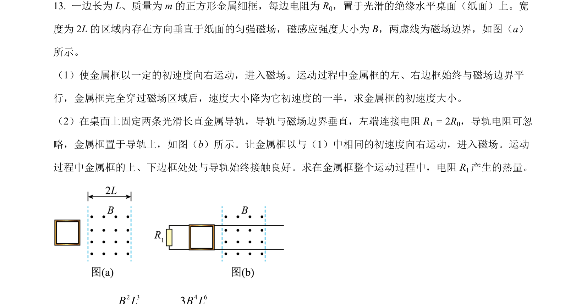
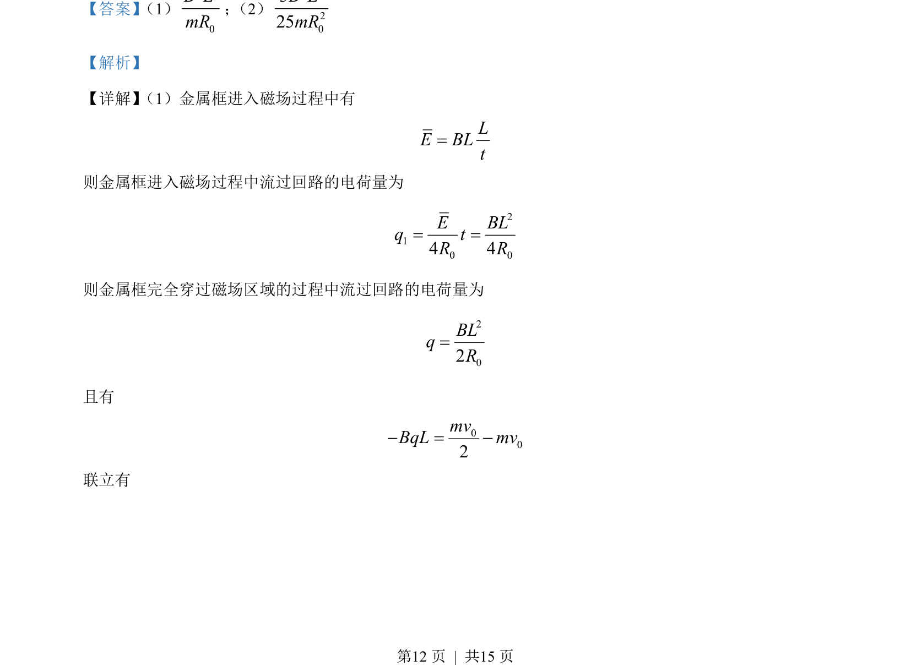
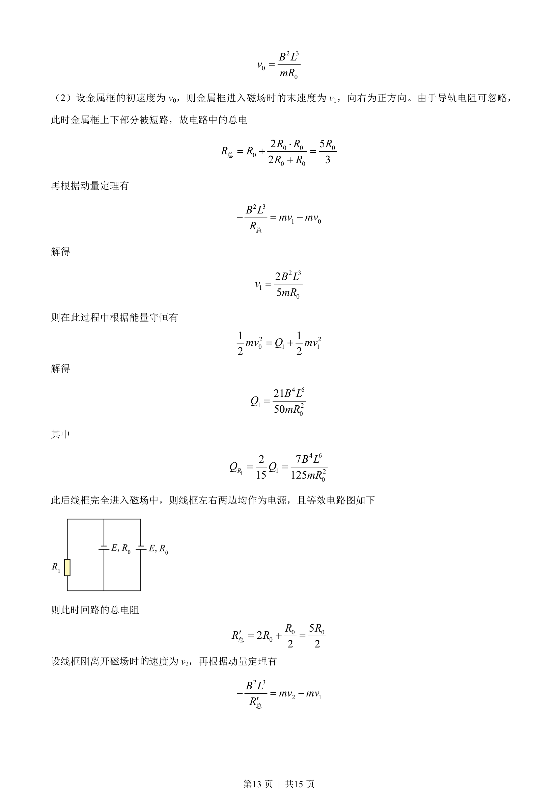
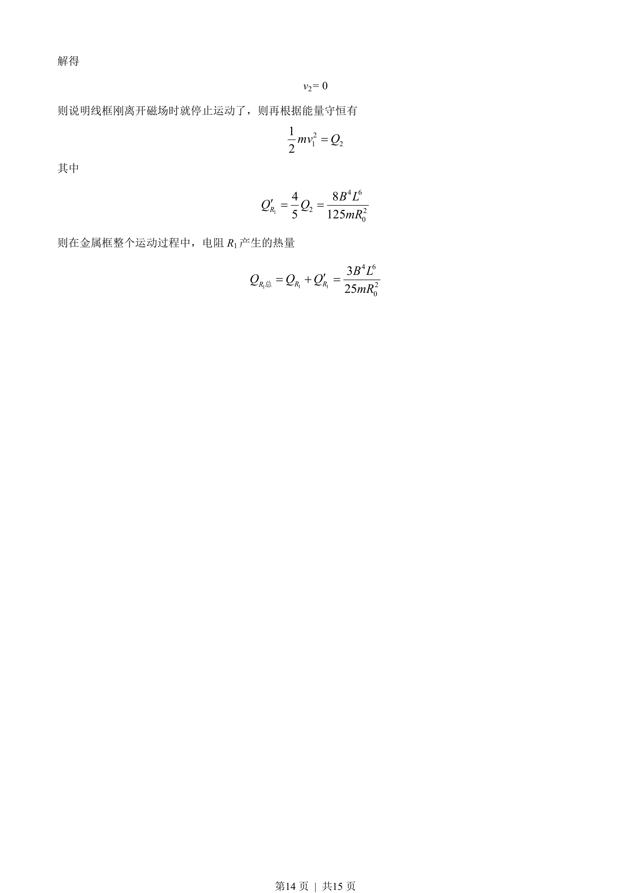

## 题面

## 摘要

金属框在磁场中运动，涉及电荷量、速度及电阻热量的计算。

## 关联考点

- [[175-电磁感应|电磁感应]]
- [[349-动量定理|动量定理]]
- [[197-能量守恒定律|能量守恒]]
- [[693-电路分析|电路分析]]

## 答案与解析

> 📄 原 PDF 第 12 页：`素材/真题/吉林/2008-2024·（吉林）物理高考真题/2023年高考物理试卷（新课标）（解析卷）.pdf`

<!-- 题干文本-start -->
## 题干文本
13. 一边长为 L、质量为 m 的正方形金属细框，每边电阻为 R0，置于光滑的绝缘水平桌面（纸面）上。宽
度为 2L 的区域内存在方向垂直于纸面的匀强磁场，磁感应强度大小为 B，两虚线为磁场边界，如图（a）
所示。
（1）使金属框以一定的初速度向右运动，进入磁场。运动过程中金属框的左、右边框始终与磁场边界平
行，金属框完全穿过磁场区域后，速度大小降为它初速度的一半，求金属框的初速度大小。
（2）在桌面上固定两条光滑长直金属导轨，导轨与磁场边界垂直，左端连接电阻 R1 = 2R0，导轨电阻可忽
略，金属框置于导轨上，如图（b）所示。让金属框以与（1）中相同的初速度向右运动，进入磁场。运动
过程中金属框的上、下边框处处与导轨始终接触良好。求在金属框整个运动过程中，电阻 R1产生的热量。
<!-- 题干文本-end -->

<!-- 解析文本-start -->
## 解析文本
【答案】 （1）
320BLmR
； （2）
4 620325B LmR
【解析】
【详解】 （1）金属框进入磁场过程中有
LE BLt=
则金属框进入磁场过程中流过回路的电荷量为
210 04 4E BLq tR R= =
则金属框完全穿过磁场区域的过程中流过回路的电荷量为
202BLqR=
且有
002mvBqL mv- = -
联立有
<!-- 解析文本-end -->
