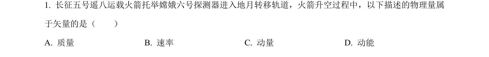
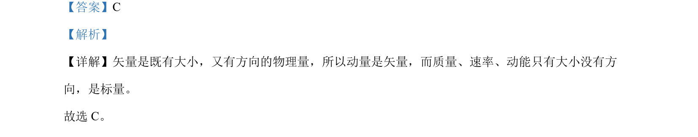

## 题面

## 摘要

该题通过辨析物理量属性，考查矢量和标量的概念区分。

## 关联考点

- [[700-矢量|矢量]]
- [[628-标量|标量]]
- [[346-动量|动量]]

## 答案与解析

> 📄 原 PDF 第 1 页：`素材/真题/吉林/2008-2024·（吉林）物理高考真题/2024年高考物理试卷（辽宁）（解析卷）.pdf`

<!-- 题干文本-start -->
## 题干文本
1. 长征五号遥八运载火箭托举嫦娥六号探测器进入地月转移轨道，火箭升空过程中，以下描述的物理量属
于矢量的是（　　）
A. 质量 B. 速率 C. 动量 D. 动能
<!-- 题干文本-end -->

<!-- 解析文本-start -->
## 解析文本
【答案】C
【解析】
【详解】矢量是既有大小，又有方向的物理量，所以动量是矢量，而质量、速率、动能只有大小没有方
向，是标量。
故选 C。
<!-- 解析文本-end -->
