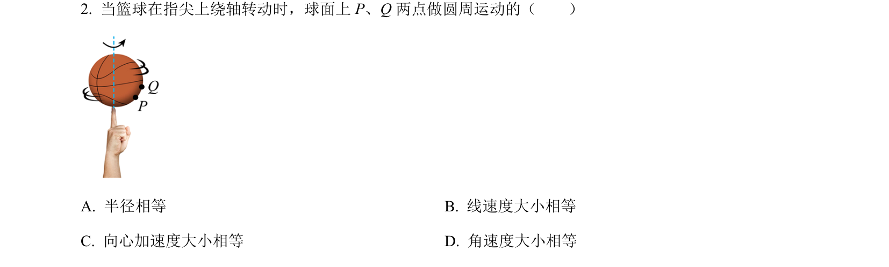
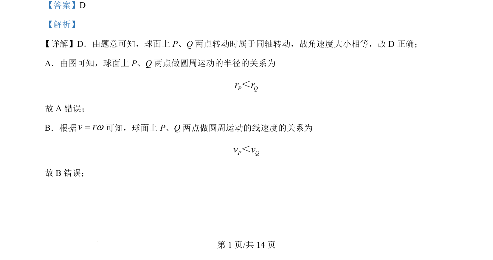
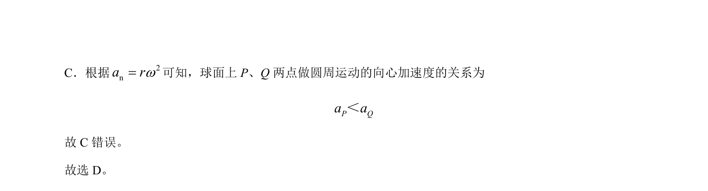

## 题面

## 摘要

同轴转动的两点角速度相等，结合半径大小比较线速度和向心加速度。

## 关联考点

- [[761-同轴转动|同轴转动]]
- [[286-角速度|角速度]]
- [[283-线速度|线速度]]
- [[257-向心加速度|向心加速度]]

## 答案与解析

> 📄 原 PDF 第 1 页：`素材/真题/吉林/2008-2024·（吉林）物理高考真题/2024年高考物理试卷（辽宁）（解析卷）.pdf`
