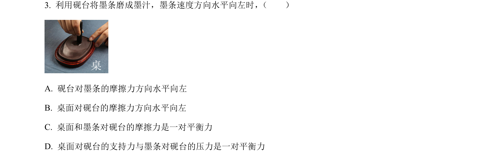
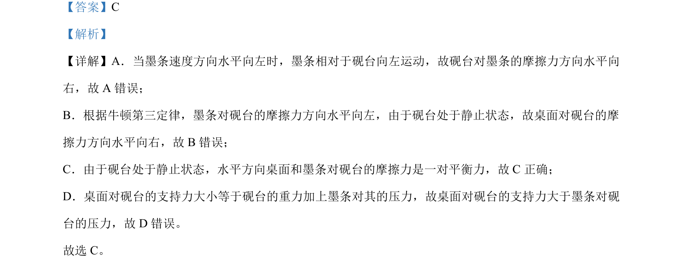

## 题面

## 摘要

本题考查摩擦力方向及平衡力与相互作用力的辨析。

## 关联考点

- [[081-摩擦力|摩擦力]]
- [[228-牛顿第三定律|牛顿第三定律]]
- [[775-平衡力|平衡力]]

## 答案与解析

> 📄 原 PDF 第 2 页：`素材/真题/吉林/2008-2024·（吉林）物理高考真题/2024年高考物理试卷（辽宁）（解析卷）.pdf`

<!-- 题干文本-start -->
## 题干文本
3. 利用砚台将墨条磨成墨汁，墨条速度方向水平向左时， （　　）
A. 砚台对墨条的摩擦力方向水平向左
B. 桌面对砚台的摩擦力方向水平向左
C. 桌面和墨条对砚台的摩擦力是一对平衡力
D. 桌面对砚台的支持力与墨条对砚台的压力是一对平衡力
<!-- 题干文本-end -->

<!-- 解析文本-start -->
## 解析文本
【答案】C
【解析】
【详解】A．当墨条速度方向水平向左时，墨条相对于砚台向左运动，故砚台对墨条的摩擦力方向水平向
右，故 A 错误；
B．根据牛顿第三定律，墨条对砚台的摩擦力方向水平向左，由于砚台处于静止状态，故桌面对砚台的摩
擦力方向水平向右，故 B错误；
C．由于砚台处于静止状态，水平方向桌面和墨条对砚台的摩擦力是一对平衡力，故 C正确；
D．桌面对砚台的支持力大小等于砚台的重力加上墨条对其的压力，故桌面对砚台的支持力大于墨条对砚
台的压力，故 D 错误。
故选 C。
<!-- 解析文本-end -->
