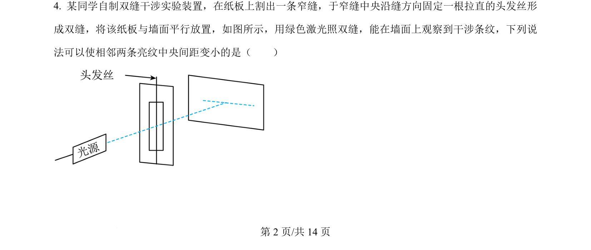
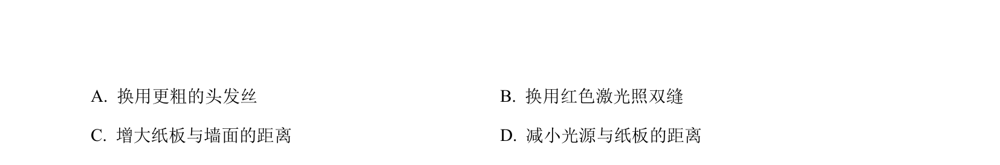
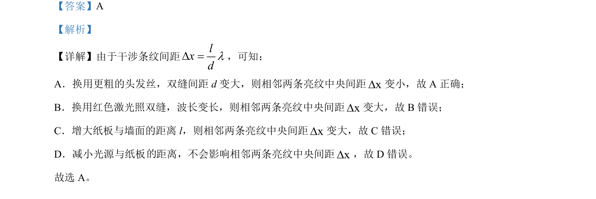

## 题面

## 摘要

该题考查双缝干涉实验中条纹间距公式的应用，通过改变实验条件判断条纹间距的变化。

## 关联考点

- [[552-双缝干涉|双缝干涉]]
- [[627-条纹间距|条纹间距]]
- [[370-波长|波长]]
- [[583-实验条件|实验条件]]

## 答案与解析

> 📄 原 PDF 第 2 页：`素材/真题/吉林/2008-2024·（吉林）物理高考真题/2024年高考物理试卷（辽宁）（解析卷）.pdf`
