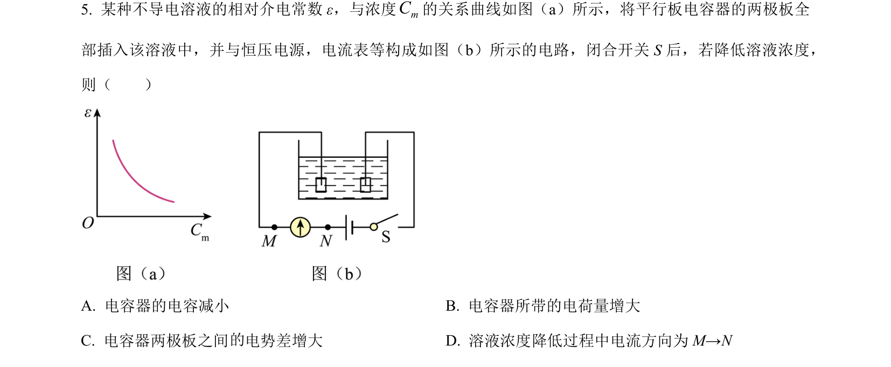
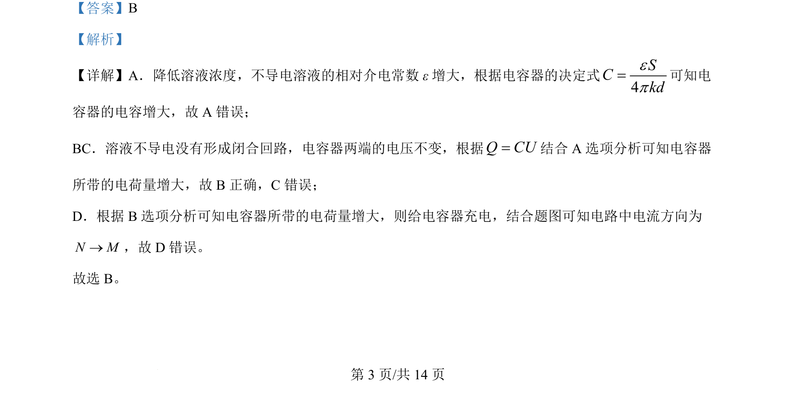

## 题面

## 摘要

本题通过溶液浓度变化分析电容器电容及充放电过程。

## 关联考点

- [[313-电容器|电容器]]
- [[675-电容决定式|电容决定式]]
- [[516-充放电|充放电]]
- [[696-电路电流方向|电路电流方向]]

## 答案与解析

> 📄 原 PDF 第 3 页：`素材/真题/吉林/2008-2024·（吉林）物理高考真题/2024年高考物理试卷（辽宁）（解析卷）.pdf`

<!-- 题干文本-start -->
## 题干文本
5. 某种不导电溶液的相对介电常数 ε，与浓度mC的关系曲线如图（a）所示，将平行板电容器的两极板全
部插入该溶液中，并与恒压电源，电流表等构成如图（ b）所示的电路，闭合开关 S 后，若降低溶液浓度，
则（　　）
A. 电容器的电容减小 B. 电容器所带的电荷量增大
C. 电容器两极板之间 电势差增大 D. 溶液浓度降低过程中电流方向为 M→N
<!-- 题干文本-end -->

<!-- 解析文本-start -->
## 解析文本
【答案】B
【解析】
【详解】A．降低溶液浓度，不导电溶液的相对介电常数 ε增大，根据电容器的决定式
4SCkdep=可知电
容器的电容增大，故 A 错误；
BC．溶液不导电没有形成闭合回路，电容器两端的电压不变，根据Q CU=结合 A 选项分析可知电容器
所带的电荷量增大，故 B正确，C错误；
D．根据 B选项分析可知电容器所带的电荷量增大，则给电容器充电，结合题图可知电路中电流方向为
N M®，故 D 错误。
故选 B。
的
的
<!-- 解析文本-end -->
