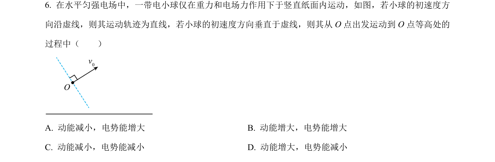
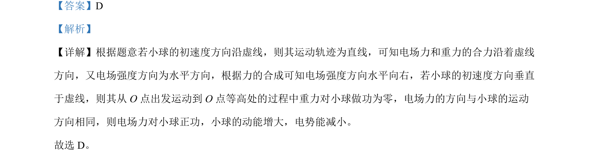

## 题面

## 摘要

带电粒子在电场与重力场复合场中的运动与能量变化分析

## 关联考点

- [[673-电场力做功|电场力做功]]
- [[251-动能定理|动能定理]]
- [[276-电势能|电势能]]

## 答案与解析

> 📄 原 PDF 第 4 页：`素材/真题/吉林/2008-2024·（吉林）物理高考真题/2024年高考物理试卷（辽宁）（解析卷）.pdf`

<!-- 题干文本-start -->
## 题干文本
6. 在水平匀强电场中，一带电小球仅在重力和电场力作用下于竖直纸面内运动，如图，若小球的初速度方
向沿虚线，则其运动轨迹为直线，若小球的初速度方向垂直于虚线，则其从 O 点出发运动到 O 点等高处的
过程中（　　）
A. 动能减小，电势能增大 B. 动能增大，电势能增大
C. 动能减小，电势能减小 D. 动能增大，电势能减小
<!-- 题干文本-end -->

<!-- 解析文本-start -->
## 解析文本
【答案】D
【解析】
【详解】根据题意若小球的初速度方向沿虚线，则其运动轨迹为直线，可知电场力和重力的合力沿着虚线
方向，又电场强度方向为水平方向，根据力的合成可知电场强度方向水平向右，若小球的初速度方向垂直
于虚线，则其从 O 点出发运动到 O 点等高处的过程中重力对小球做功为零，电场力的方向与小球的运动
方向相同，则电场力对小球正功，小球的动能增大，电势能减小。
故选 D。
<!-- 解析文本-end -->
