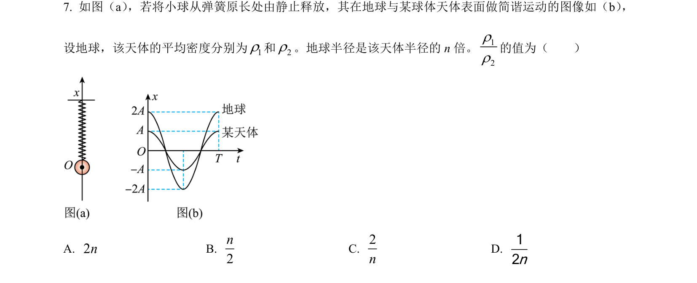
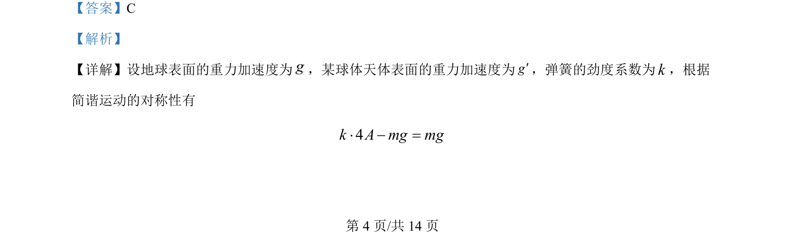
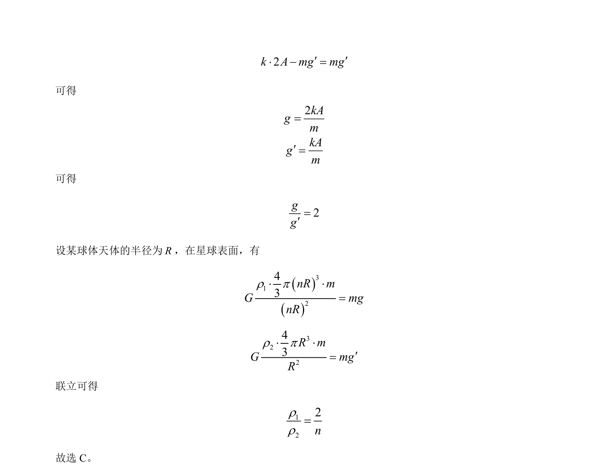

## 题面

## 摘要

考查简谐运动对称性与天体表面重力加速度的综合应用，求天体密度比。

## 关联考点

- [[简谐运动对称性]]
- [[246-万有引力定律|万有引力定律]]
- [[天体表面重力加速度]]
- [[019-密度|密度]]

## 答案与解析

> 📄 原 PDF 第 4 页：`素材/真题/吉林/2008-2024·（吉林）物理高考真题/2024年高考物理试卷（辽宁）（解析卷）.pdf`
