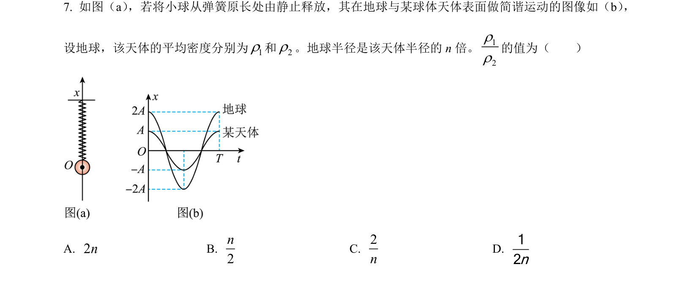
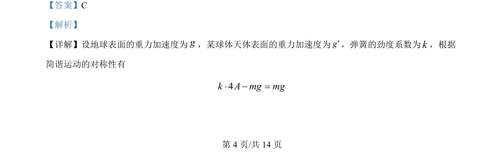
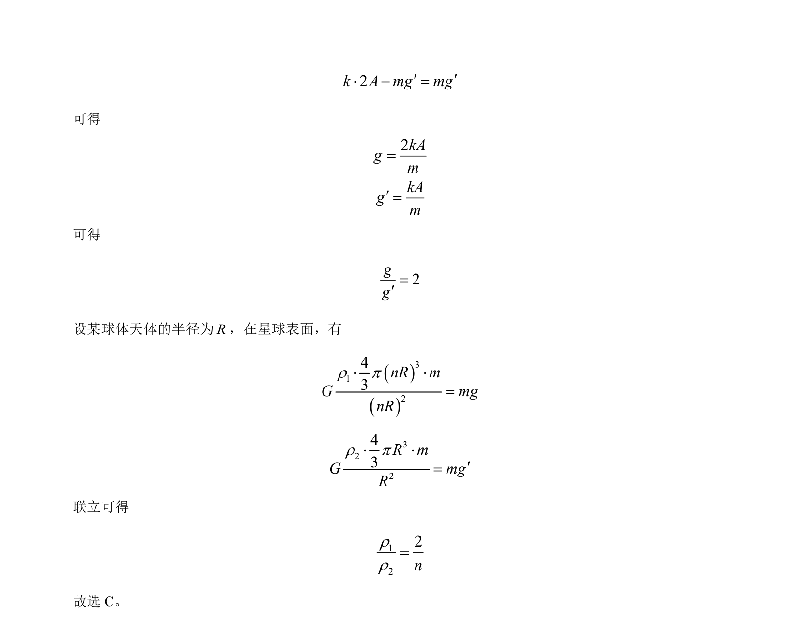

## 题面

## 摘要

考查简谐运动对称性与天体表面重力加速度的综合应用，求天体密度比。

## 关联考点

- [[714-简谐运动对称性|简谐运动对称性]]
- [[246-万有引力定律|万有引力定律]]
- [[467-天体表面重力加速度|天体表面重力加速度]]
- [[019-密度|密度]]

## 答案与解析

> 📄 原 PDF 第 4 页：`素材/真题/吉林/2008-2024·（吉林）物理高考真题/2024年高考物理试卷（辽宁）（解析卷）.pdf`

<!-- 题干文本-start -->
## 题干文本
7. 如图（a） ，若将小球从弹簧原长处由静止释放，其在地球与某球体天体表面做简谐运动的图像如（b） ，
设地球，该天体的平均密度分别为1r和2r。地球半径是该天体半径的 n 倍。12rr
的值为（　　）
A. 2nB. 
2nC. 2n
D. 12n
<!-- 题干文本-end -->

<!-- 解析文本-start -->
## 解析文本
【答案】C
【解析】
【详解】设地球表面的重力加速度为g，某球体天体表面的重力加速度为g¢，弹簧的劲度系数为k，根据
简谐运动的对称性有
4k A mg mg× - =
<!-- 解析文本-end -->
