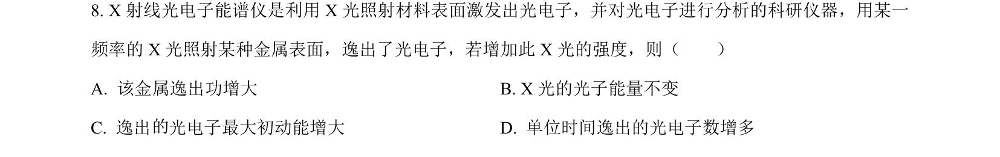
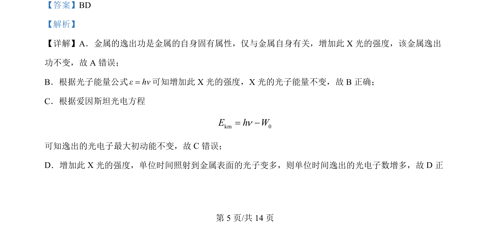

## 题面

## 摘要

本题考查光电效应中光强对逸出功、光子能量、最大初动能和光电子数的影响。

## 关联考点

- [[417-光电效应|光电效应]]
- [[745-逸出功|逸出功]]
- [[453-光子能量|光子能量]]
- [[454-光强|光强]]

## 答案与解析

> 📄 原 PDF 第 5 页：`素材/真题/吉林/2008-2024·（吉林）物理高考真题/2024年高考物理试卷（辽宁）（解析卷）.pdf`

<!-- 题干文本-start -->
## 题干文本
8. X 射线光电子能谱仪是利用 X 光照射材料表面激发出光电子，并对光电子进行分析的科研仪器，用某一
频率的 X 光照射某种金属表面，逸出了光电子，若增加此 X 光的强度，则（　　）
A. 该金属逸出功增大 B. X 光的光子能量不变
C. 逸出 光电子最大初动能增大 D. 单位时间逸出的光电子数增多
<!-- 题干文本-end -->

<!-- 解析文本-start -->
## 解析文本
【答案】BD
【解析】
【详解】A．金属的逸出功是金属的自身固有属性，仅与金属自身有关，增加此 X 光的强度，该金属逸出
功不变，故 A 错误；
B．根据光子能量公式εhν=可知增加此 X 光的强度，X 光的光子能量不变，故 B正确；
C．根据爱因斯坦光电方程
km 0E h Wn= -
可知逸出的光电子最大初动能不变，故 C错误；
D．增加此 X 光的强度，单位时间照射到金属表面的光子变多，则单位时间逸出的光电子数增多，故 D 正
的
<!-- 解析文本-end -->
