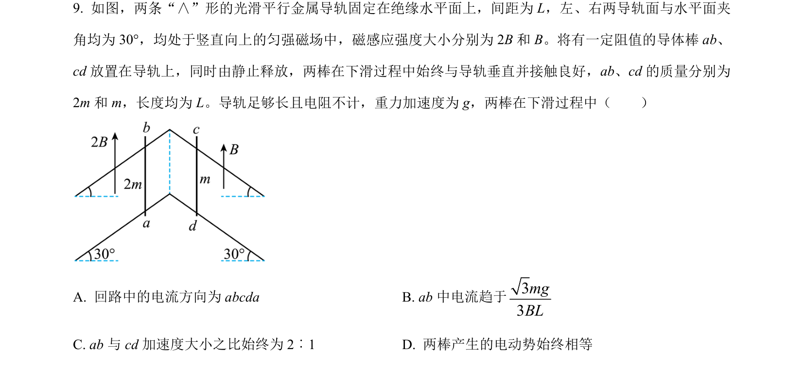
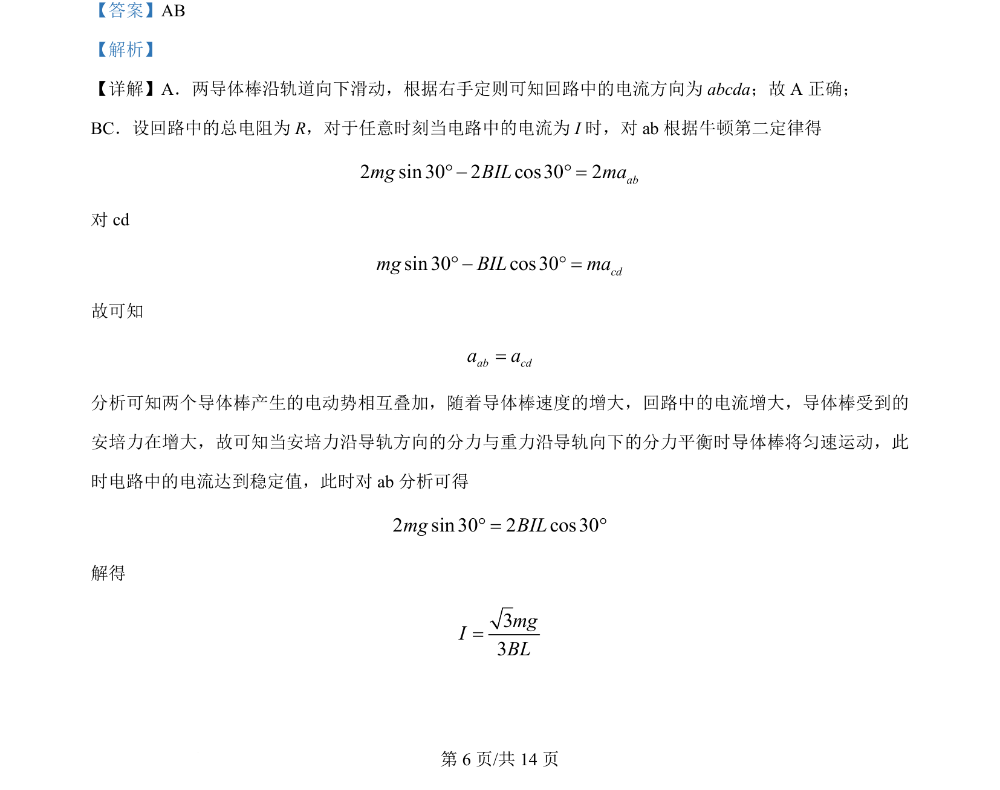
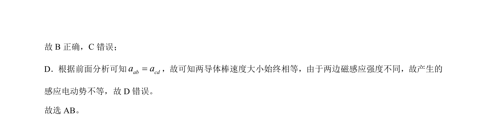

## 题面

## 摘要

两导体棒在倾斜导轨上运动，分析电流方向、安培力、加速度关系及匀速条件。

## 关联考点

- [[135-安培定则|右手定则]]
- [[188-磁场对通电导体的作用|安培力]]
- [[229-牛顿第二定律|牛顿第二定律]]
- [[387-感应电动势|感应电动势]]

## 答案与解析

> 📄 原 PDF 第 6 页：`素材/真题/吉林/2008-2024·（吉林）物理高考真题/2024年高考物理试卷（辽宁）（解析卷）.pdf`
