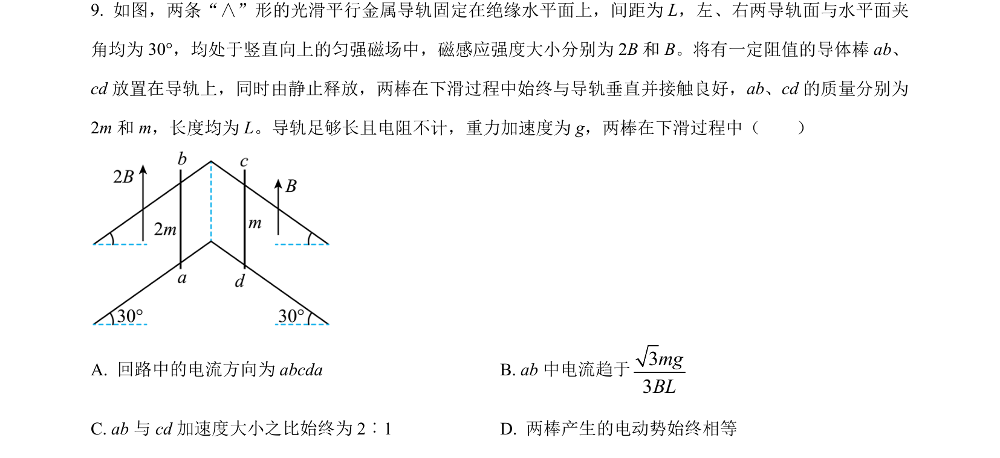
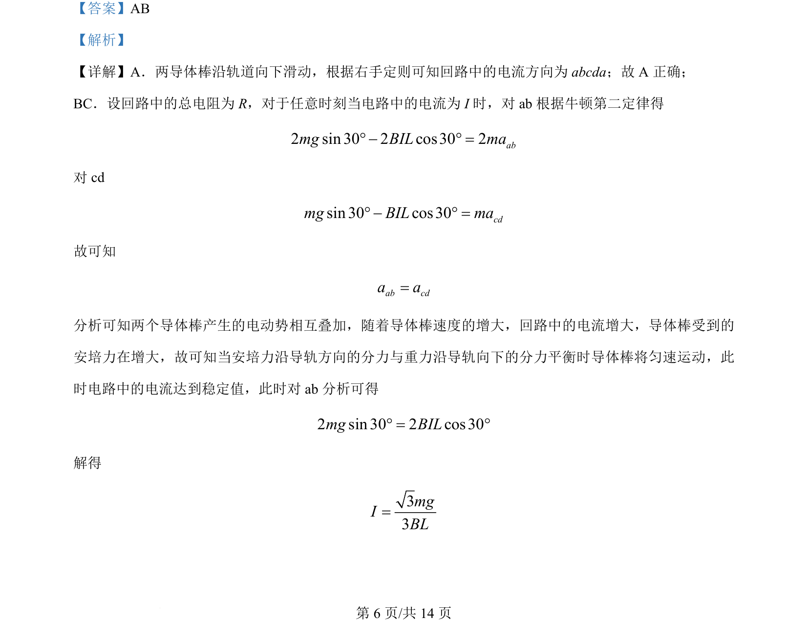
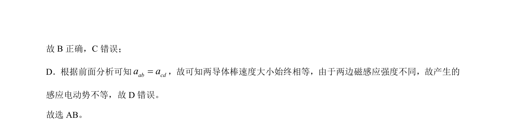

## 题面

## 摘要

两导体棒在倾斜导轨上运动，分析电流方向、安培力、加速度关系及匀速条件。

## 关联考点

- [[135-安培定则|右手定则]]
- [[188-磁场对通电导体的作用|安培力]]
- [[229-牛顿第二定律|牛顿第二定律]]
- [[387-感应电动势|感应电动势]]

## 答案与解析

> 📄 原 PDF 第 6 页：`素材/真题/吉林/2008-2024·（吉林）物理高考真题/2024年高考物理试卷（辽宁）（解析卷）.pdf`

<!-- 题干文本-start -->
## 题干文本
9. 如图，两条“∧”形的光滑平行金属导轨固定在绝缘水平面上，间距为 L，左、右两导轨面与水平面夹
角均为 30°，均处于竖直向上的匀强磁场中，磁感应强度大小分别为 2B 和 B。将有一定阻值的导体棒 ab、
cd放置在导轨上，同时由静止释放，两棒在下滑过程中始终与导轨垂直并接触良好，ab、cd的质量分别为
2m 和 m，长度均为 L。导轨足够长且电阻不计，重力加速度为 g，两棒在下滑过程中（　　）
A. 回路中的电流方向为 abcdaB. ab 中电流趋于33mgBL
C. ab与 cd加速度大小之比始终为 2︰1 D. 两棒产生的电动势始终相等
<!-- 题干文本-end -->

<!-- 解析文本-start -->
## 解析文本
【答案】AB
【解析】
【详解】A．两导体棒沿轨道向下滑动，根据右手定则可知回路中的电流方向为 abcda；故 A 正确；
BC．设回路中的总电阻为 R，对于任意时刻当电路中的电流为 I 时，对 ab根据牛顿第二定律得
2 sin 30 2 cos30 2abmg BIL ma° - ° =
对 cd
sin 30 cos30cdmg BIL ma° - ° =
故可知
ab cda a=
分析可知两个导体棒产生的电动势相互叠加，随着导体棒速度的增大，回路中的电流增大，导体棒受到的
安培力在增大，故可知当安培力沿导轨方向的分力与重力沿导轨向下的分力平衡时导体棒将匀速运动，此
时电路中的电流达到稳定值，此时对 ab分析可得
2 sin 30 2 cos30mg BIL° = °
解得
33mgIBL=
<!-- 解析文本-end -->
