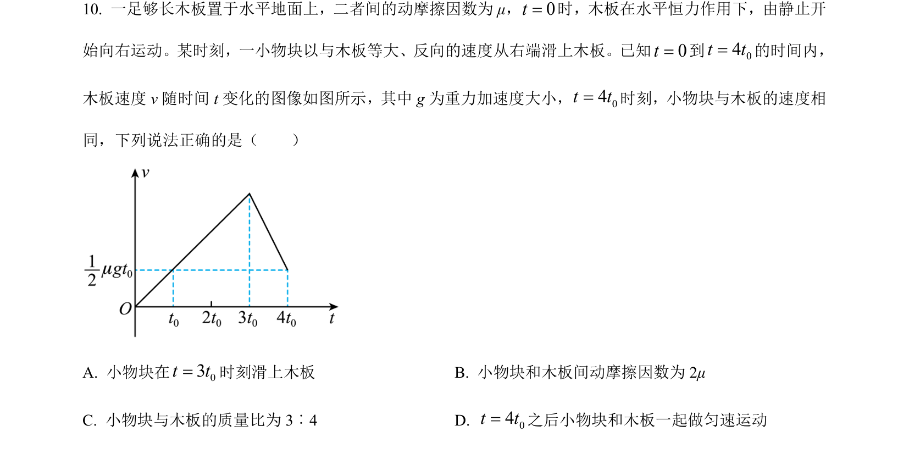
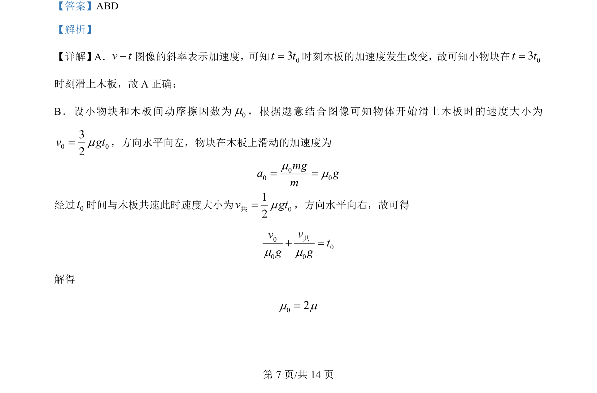
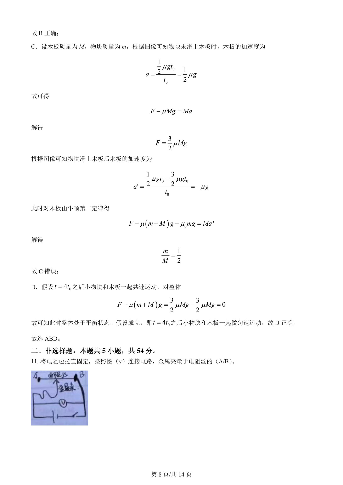
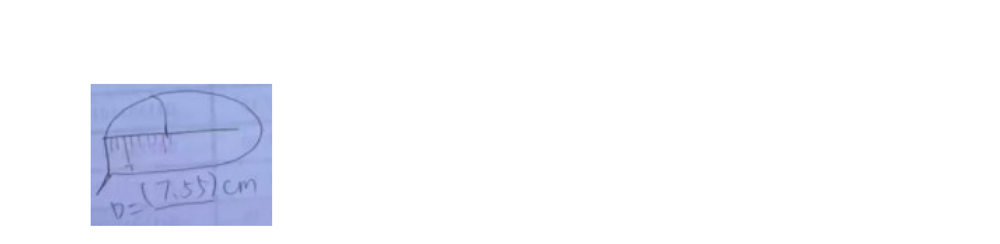

## 题面

## 摘要

考查 v-t 图像分析木板与物块相对运动、受力及运动状态判断。

## 关联考点

- [[497-v-t图像|v-t图像]]
- [[229-牛顿第二定律|牛顿第二定律]]
- [[081-摩擦力|摩擦力]]
- [[619-整体法隔离法|整体法隔离法]]

## 答案与解析

> 📄 原 PDF 第 7 页：`素材/真题/吉林/2008-2024·（吉林）物理高考真题/2024年高考物理试卷（辽宁）（解析卷）.pdf`
