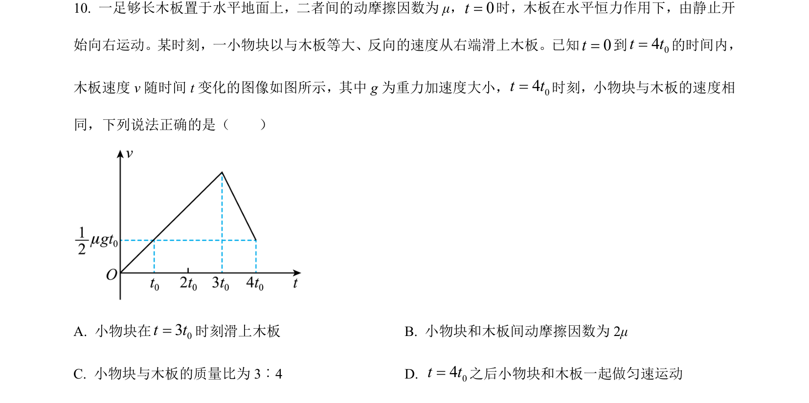
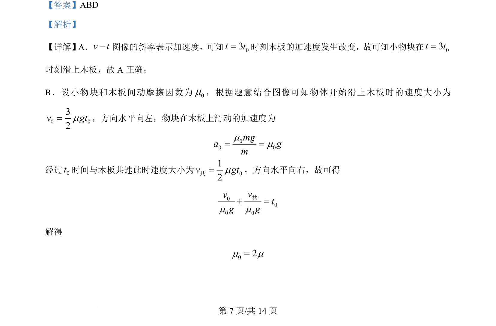
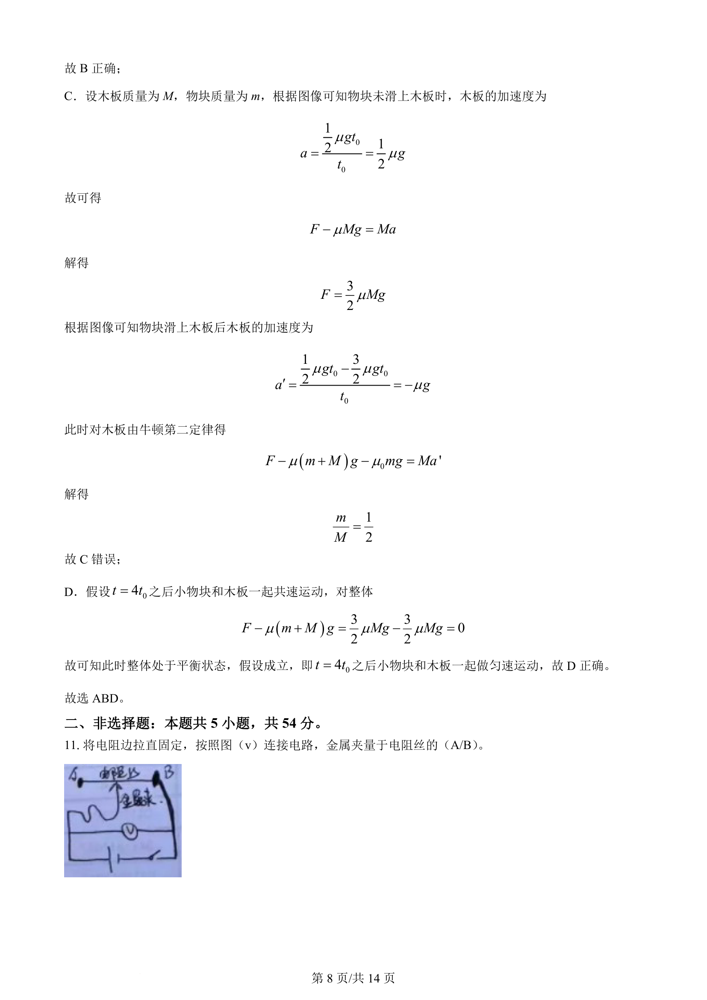
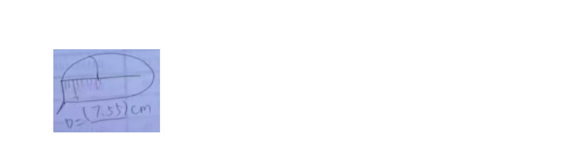

## 题面

## 摘要

考查 v-t 图像分析木板与物块相对运动、受力及运动状态判断。

## 关联考点

- [[497-v-t图像|v-t图像]]
- [[229-牛顿第二定律|牛顿第二定律]]
- [[081-摩擦力|摩擦力]]
- [[619-整体法隔离法|整体法隔离法]]

## 答案与解析

> 📄 原 PDF 第 7 页：`素材/真题/吉林/2008-2024·（吉林）物理高考真题/2024年高考物理试卷（辽宁）（解析卷）.pdf`

<!-- 题干文本-start -->
## 题干文本
10. 一足够长木板置于水平地面上，二者间的动摩擦因数为 μ，0=t时，木板在水平恒力作用下，由静止开
始向右运动。 某时刻， 一小物块以与木板等大、 反向的速度从右端滑上木板。 已知0=t到04t t=的时间内，
木板速度 v随时间 t变化的图像如图所示，其中g 为重力加速度大小，04t t=时刻， 小物块与木板的速度相
同，下列说法正确的是（　　）
A. 小物块在03t t=时刻滑上木板 B. 小物块和木板间动摩擦因数为 2μ
C. 小物块与木板的质量比为 3︰4 D. 04t t=之后小物块和木板一起做匀速运动
<!-- 题干文本-end -->

<!-- 解析文本-start -->
## 解析文本
【答案】ABD
【解析】
【详解】A．v t-图像的斜率表示加速度， 可知03t t=时刻木板的加速度发生改变， 故可知小物块在03t t=
时刻滑上木板，故 A 正确；
B．设小物块和木板间动摩擦因数为0m，根据题意结合图像可知物体开始滑上木板时的速度大小为
0 032v gtm=，方向水平向左，物块在木板上滑动的加速度为
00 0mga gmmm= =
经过0t时间与木板共速此时速度大小为 012v gtm=共，方向水平向右，故可得
000 0vvtg gm m+ =共
解得
02m m=
<!-- 解析文本-end -->
