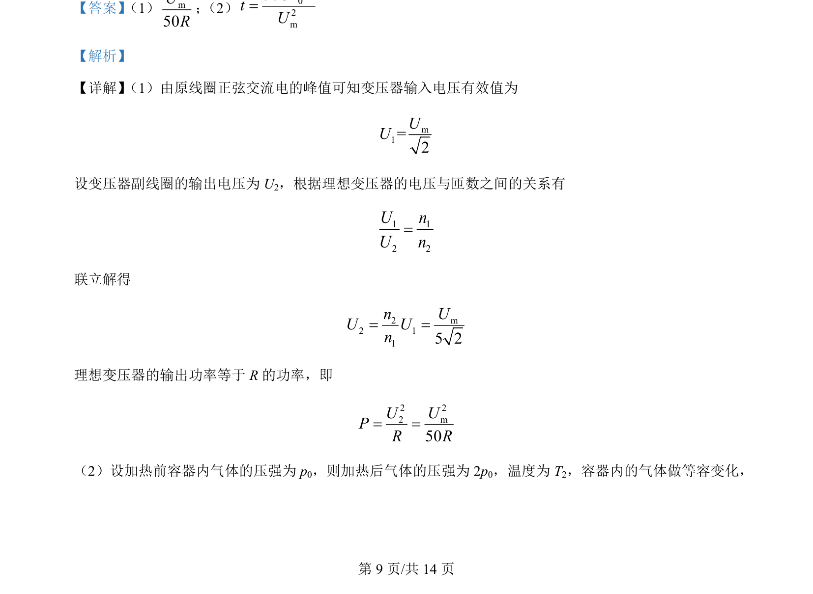
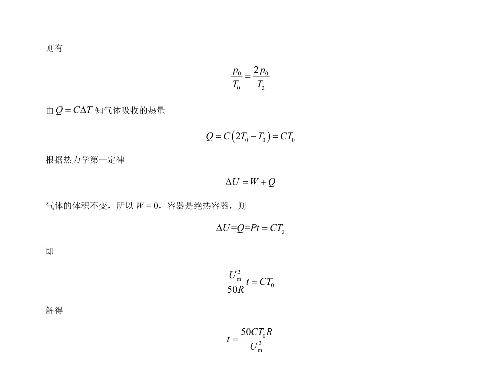

## 题面

## 摘要

理想变压器副线圈接电热丝加热绝热容器内理想气体，求变压器输出功率和气体压强达到2倍所需通电时间。

## 关联考点

- [[381-变压器|变压器]]
- [[175-电磁感应|电磁感应]]
- [[446-理想气体状态方程|气体状态方程]]
- [[热学]]

## 答案与解析

> 📄 原 PDF 第 9 页：`素材/真题/吉林/2008-2024·（吉林）物理高考真题/2024年高考物理试卷（辽宁）（解析卷）.pdf`
