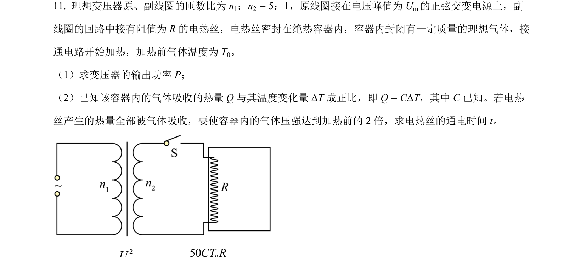
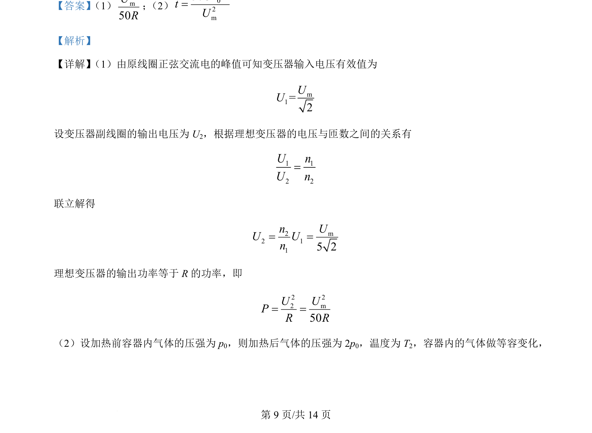
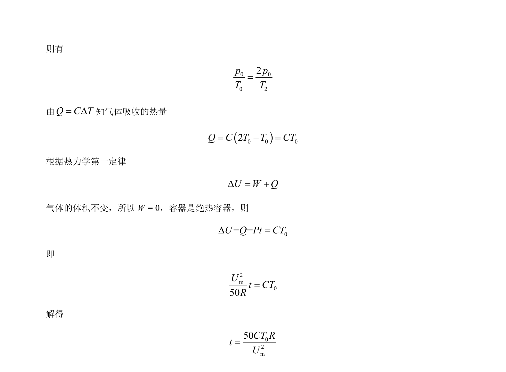

## 题面

## 摘要

理想变压器副线圈接电热丝加热绝热容器内理想气体，求变压器输出功率和气体压强达到2倍所需通电时间。

## 关联考点

- [[381-变压器|变压器]]
- [[175-电磁感应|电磁感应]]
- [[446-理想气体状态方程|气体状态方程]]
- [[658-热学|热学]]

## 答案与解析

> 📄 原 PDF 第 9 页：`素材/真题/吉林/2008-2024·（吉林）物理高考真题/2024年高考物理试卷（辽宁）（解析卷）.pdf`

<!-- 题干文本-start -->
## 题干文本
11. 理想变压器原、副线圈的匝数比为 n1：n2 = 5：1，原线圈接在电压峰值为 Um的正弦交变电源上，副
线圈的回路中接有阻值为 R的电热丝，电热丝密封在绝热容器内，容器内封闭有一定质量的理想气体，接
通电路开始加热，加热前气体温度为 T0。
（1）求变压器的输出功率 P；
（2）已知该容器内的气体吸收的热量 Q 与其温度变化量 ΔT 成正比，即 Q = CΔT，其中 C已知。若电热
丝产生的热量全部被气体吸收，要使容器内的气体压强达到加热前的 2 倍，求电热丝的通电时间 t。
<!-- 题干文本-end -->

<!-- 解析文本-start -->
## 解析文本
【答案】 （1）
2m50UR
； （2） 02m50CT RtU=
【解析】
【详解】 （1）由原线圈正弦交流电的峰值可知变压器输入电压有效值为
m1=2UU
设变压器副线圈的输出电压为 U2，根据理想变压器的电压与匝数之间的关系有
1 12 2U nU n=
联立解得
m22 115 2n UU Un= =
理想变压器的输出功率等于 R的功率，即
2 22 m50U UPRR= =
（2）设加热前容器内气体的压强为 p0，则加热后气体的压强为 2p0，温度为 T2，容器内的气体做等容变化，
<!-- 解析文本-end -->
