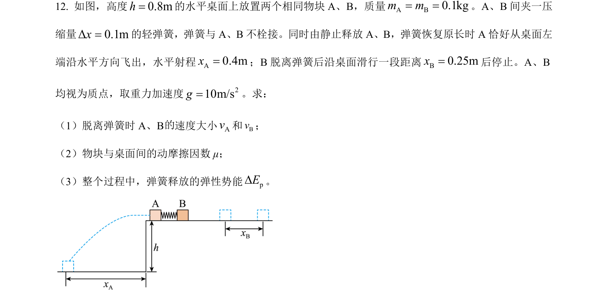
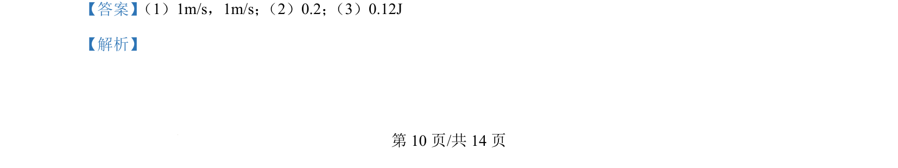
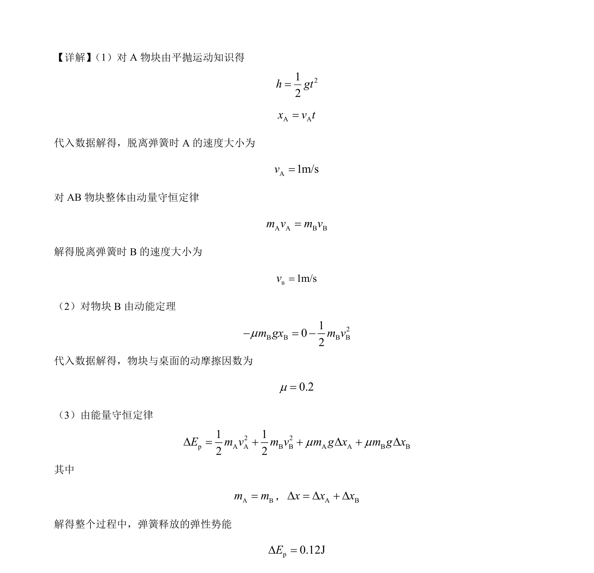

## 题面

## 摘要

该题通过弹簧弹射双物块模型，结合平抛运动与匀减速直线运动，考查动量守恒和能量守恒的应用。

## 关联考点

- [[261-平抛运动|平抛运动]]
- [[动量守恒]]
- [[251-动能定理|动能定理]]
- [[197-能量守恒定律|能量守恒]]

## 答案与解析

> 📄 原 PDF 第 10 页：`素材/真题/吉林/2008-2024·（吉林）物理高考真题/2024年高考物理试卷（辽宁）（解析卷）.pdf`
