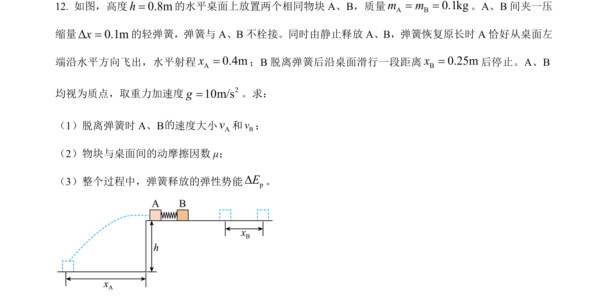
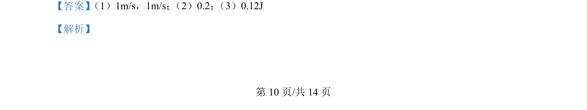
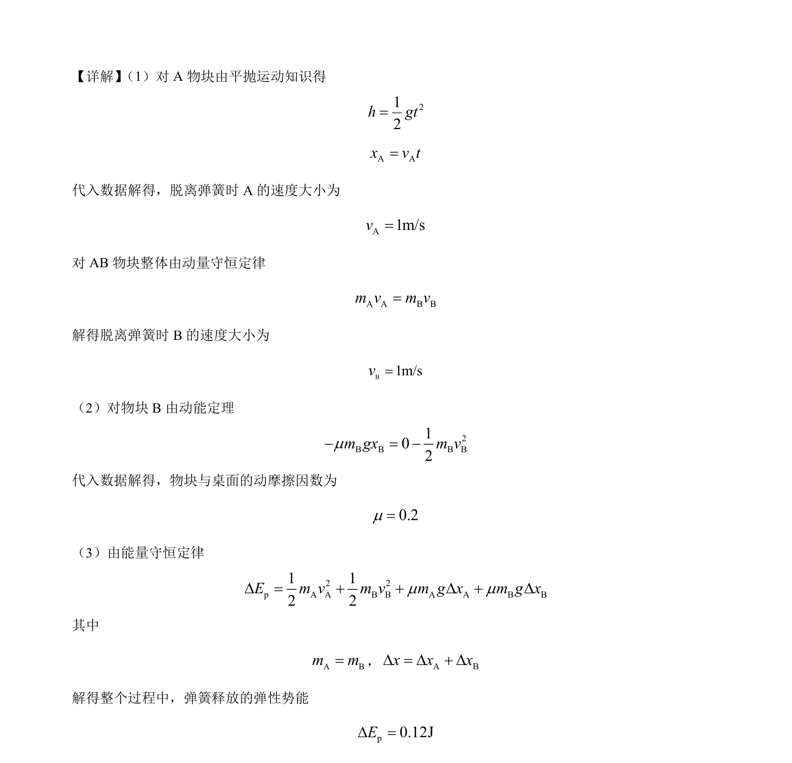

## 题面

## 摘要

该题通过弹簧弹射双物块模型，结合平抛运动与匀减速直线运动，考查动量守恒和能量守恒的应用。

## 关联考点

- [[261-平抛运动|平抛运动]]
- [[539-动量守恒|动量守恒]]
- [[251-动能定理|动能定理]]
- [[197-能量守恒定律|能量守恒]]

## 答案与解析

> 📄 原 PDF 第 10 页：`素材/真题/吉林/2008-2024·（吉林）物理高考真题/2024年高考物理试卷（辽宁）（解析卷）.pdf`

<!-- 题干文本-start -->
## 题干文本
12. 如图，高度0.8mh=的水平桌面上放置两个相同物块 A、B，质量A B0.1kgm m= =。A、B 间夹一压
缩量Δ0.1mx=的轻弹簧，弹簧与 A、B不栓接。同时由静止释放 A、B，弹簧恢复原长时 A 恰好从桌面左
端沿水平方向飞出，水平射程A0.4mx=；B 脱离弹簧后沿桌面滑行一段距离B0.25mx=后停止。A、B
均视为质点，取重力加速度 210m/sg=。求：
（1）脱离弹簧时 A、B 速度大小Av和Bv；
（2）物块与桌面间的动摩擦因数 μ；
（3）整个过程中，弹簧释放的弹性势能pED。
<!-- 题干文本-end -->

<!-- 解析文本-start -->
## 解析文本
【答案】 （1）1m/s，1m/s； （2）0.2； （3）0.12J
【解析】
的
<!-- 解析文本-end -->
