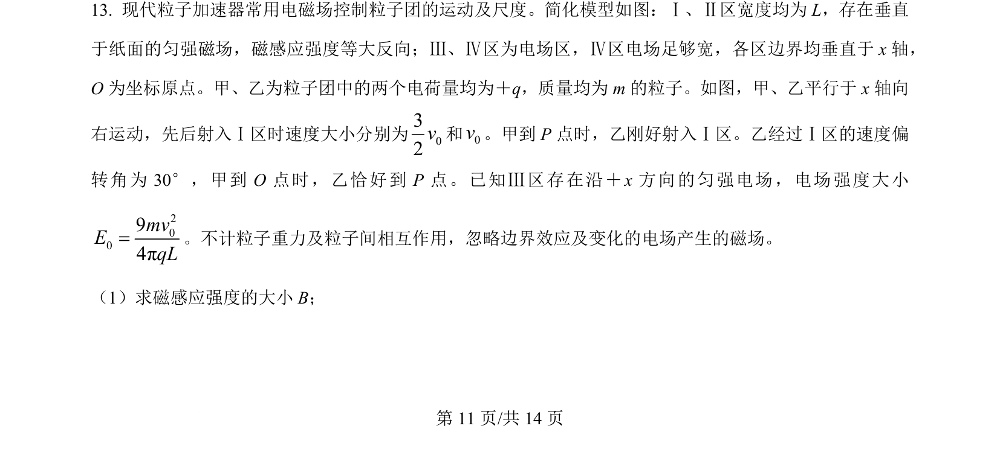
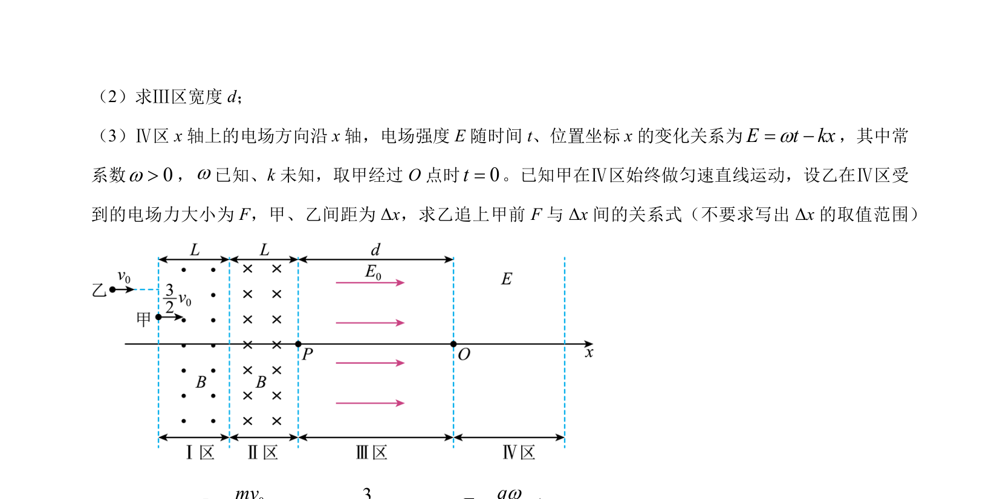
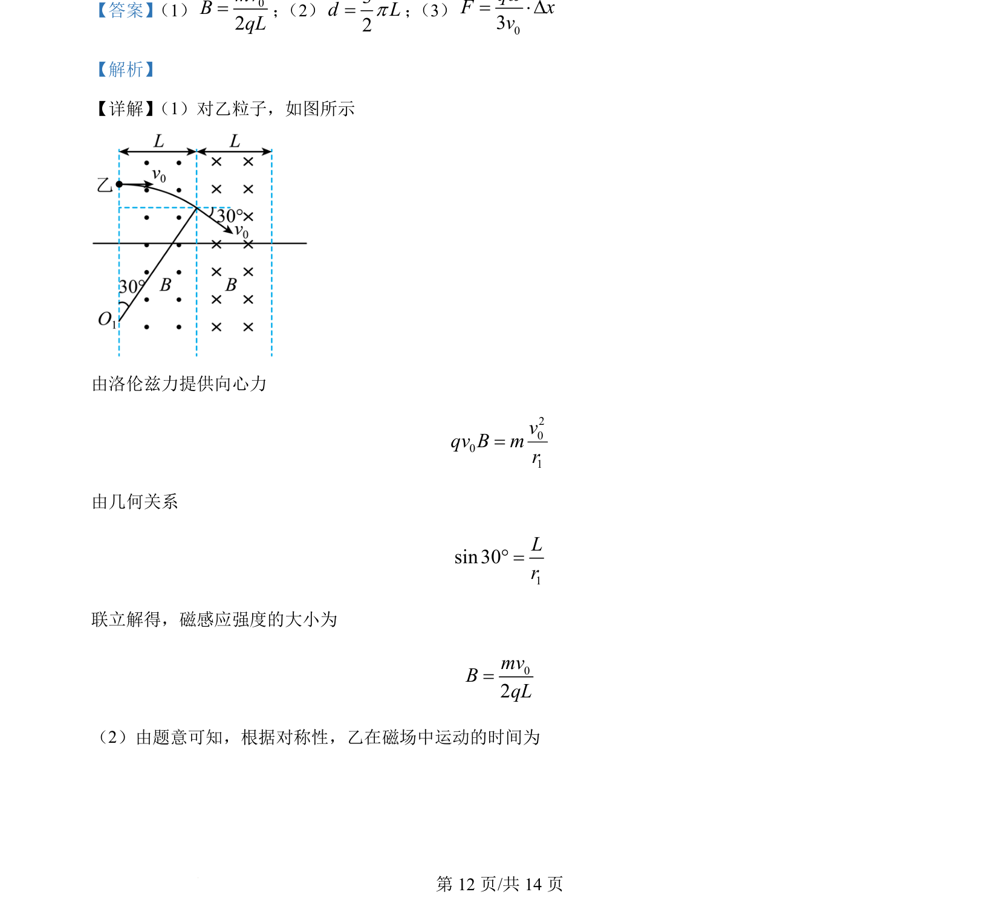
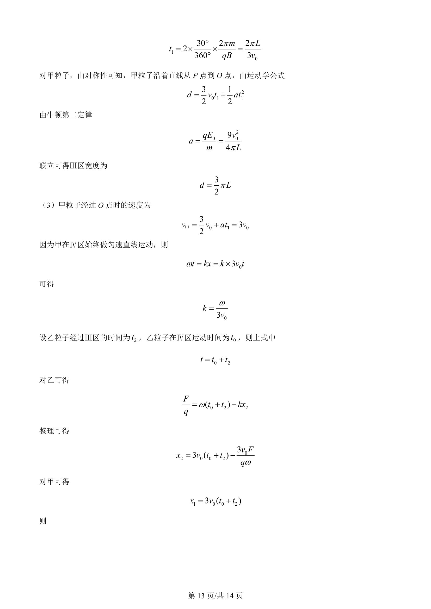
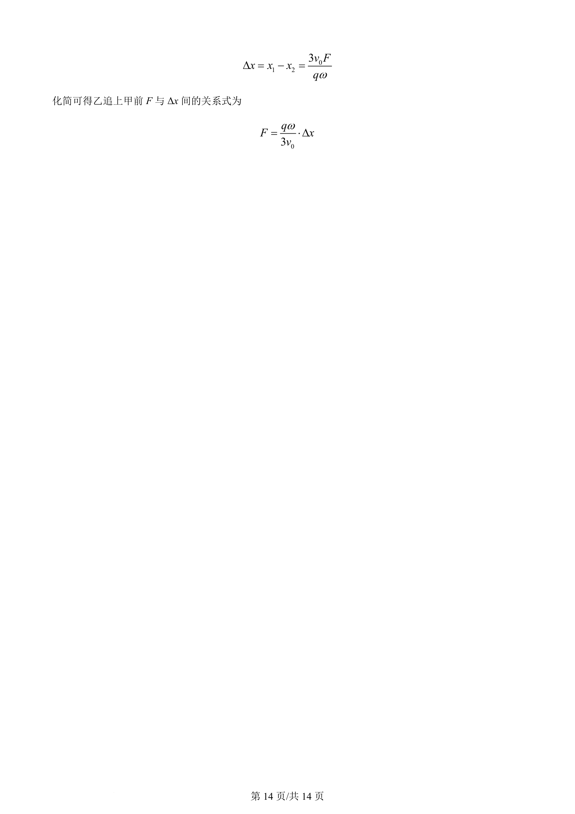

## 题面

## 摘要

粒子在电磁场中的偏转与运动规律分析，求解磁感应强度大小

## 关联考点

- [[598-带电粒子在磁场中的圆周运动|带电粒子在磁场中的圆周运动]]
- [[456-几何关系|几何关系]]
- [[304-洛伦兹力|洛伦兹力]]

## 答案与解析

> 📄 原 PDF 第 11 页：`素材/真题/吉林/2008-2024·（吉林）物理高考真题/2024年高考物理试卷（辽宁）（解析卷）.pdf`
