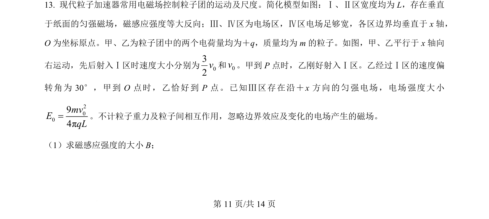
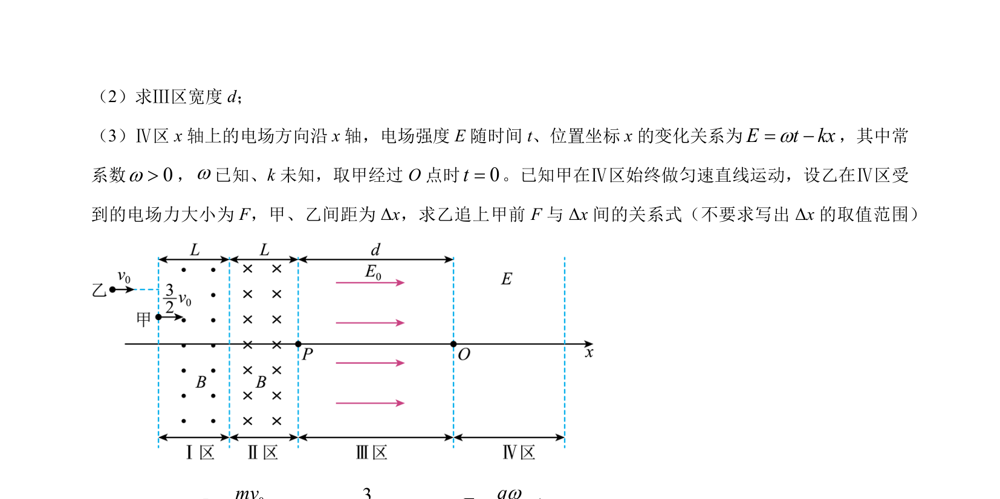
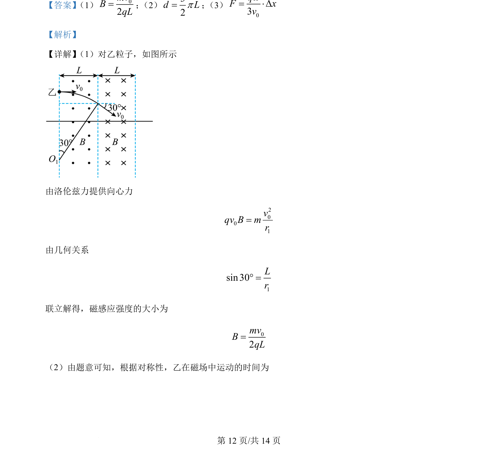
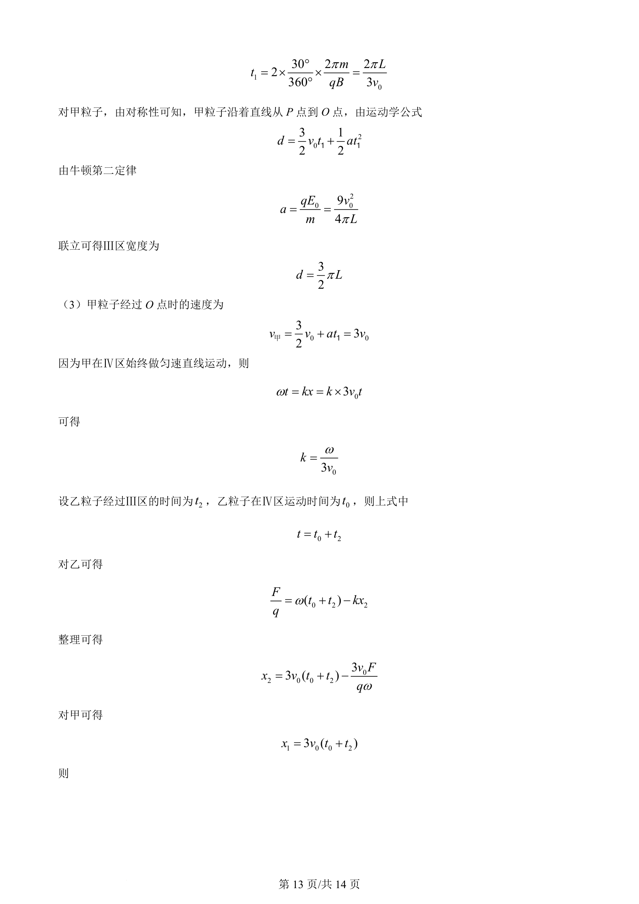
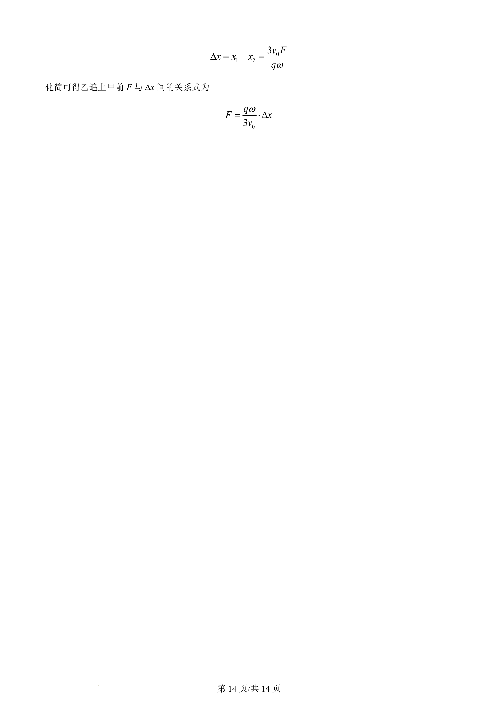

## 题面

## 摘要

粒子在电磁场中的偏转与运动规律分析，求解磁感应强度大小

## 关联考点

- [[301-带电粒子在磁场中圆周运动|带电粒子在磁场中的圆周运动]]
- [[456-几何关系|几何关系]]
- [[304-洛伦兹力|洛伦兹力]]

## 答案与解析

> 📄 原 PDF 第 11 页：`素材/真题/吉林/2008-2024·（吉林）物理高考真题/2024年高考物理试卷（辽宁）（解析卷）.pdf`

<!-- 题干文本-start -->
## 题干文本
13. 现代粒子加速器常用电磁场控制粒子团的运动及尺度。简化模型如图：Ⅰ、Ⅱ区宽度均为 L，存在垂直
于纸面的匀强磁场，磁感应强度等大反向；Ⅲ、Ⅳ区为电场区，Ⅳ区电场足够宽，各区边界均垂直于 x 轴，
O 为坐标原点。甲、乙为粒子团中的两个电荷量均为＋q，质量均为 m 的粒子。如图，甲、乙平行于 x轴向
右运动，先后射入Ⅰ区时速度大小分别为032v和0v。甲到 P 点时，乙刚好射入Ⅰ区。乙经过Ⅰ区的速度偏
转角为 30°，甲到 O 点时，乙恰好到 P 点。已知Ⅲ区存在沿＋ x 方向的匀强电场，电场强度大小
20094πmvEqL=。不计粒子重力及粒子间相互作用，忽略边界效应及变化的电场产生的磁场。
（1）求磁感应强度的大小 B；
<!-- 题干文本-end -->

<!-- 解析文本-start -->
## 解析文本

<!-- 解析文本-end -->
